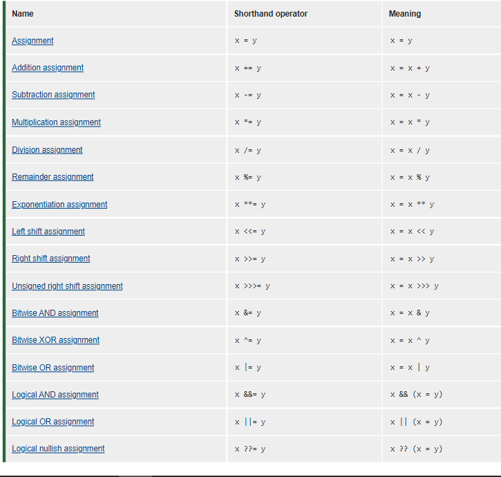
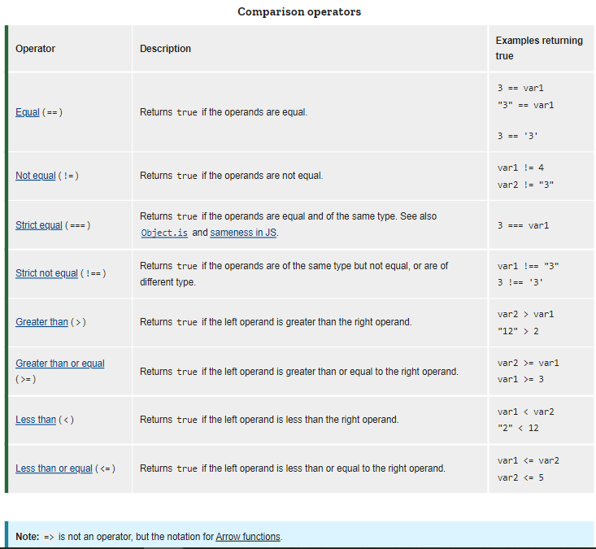

# Expressions and operators
- ## Operators
 _***In mathematics and sometimes in computer programming, an operator is a character that represents an action, as for example x is an arithmetic operator that represents multiplication. In computer programs, one of the most familiar sets of operators, the Boolean operators, is used to work with true/false values.***_

1. **Assignment operators**
2. **Comparison operators**
3. **Arithmetic operators**
4. **Bitwise operators**
5. **Logical operators**
6. **String operators**
7. **Conditional (ternary) operator**
8. **Comma operator**
9. **Unary operators**
10. **Relational operators**

+ **Assignment operators**

+ **Comparison operators**
 

 

 + **Operator precedence**

 
--------------------------------------------------------
--------------------------------------------------------

- ## Expressions

_ syntactic entity in a programming language that may be evaluated to determine its value.It is a combination of one or more constants, variables, functions, and operators that the programming language interprets (according to its particular rules of precedence and of association) and computes to produce ("to return", in a stateful environment) another value. This process, for mathematical expressions, is called evaluation._

