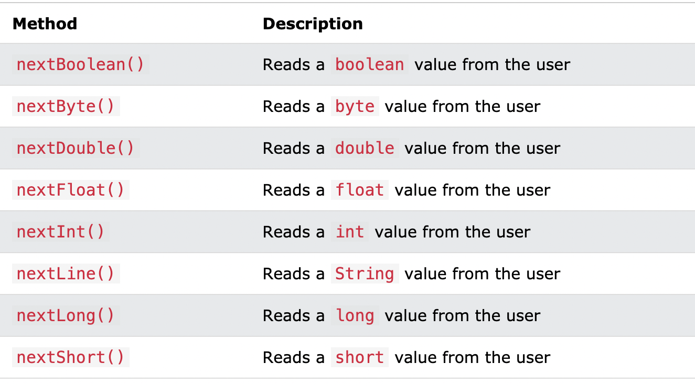

# Java Primitives versus Objects

Primitives Variable:
1. int 
2. Double
3. Float 
4. Boolean
..etc

* Primitives type  of variable is **immutable** then the state can't change once the object is constructed.

***Default Values***
* for numeric is 0
* for boolean type **false** 
* for the char type `\u0000 `
* For the wrapper classes `Null`

Note: 
* the primitive types are much faster and require much less memory.
* objects in Java are slower and have a bigger memory impact than their primitive analogs.

----------------------------------------

# Exception

***is a problem that arises during the execution of a program.***

## Catching Exceptions

**A method catches an exception using a combination of the try and catch keywords. A try/catch block is placed around the code that might generate an exception.** 

### Syntax
`try {
   // Protected code
} catch (ExceptionName e1) {
   // Catch block
}`

# Scanner

***The Scanner class is used to get user input, and it is found in the java.util package.***

To use the Scanner class, create an object of the class and use any of the available methods found in the Scanner class documentation.

ex:

`import java.util.Scanner;  // Import the Scanner class`

`class Main {
  public static void main(String[] args) {
    Scanner myObj = new Scanner(System.in);  // Create a Scanner object
    System.out.println("Enter username");`

    String userName = myObj.nextLine();  // Read user input
    System.out.println("Username is: " + userName);  // Output user input}}

if the input is `Mansoor`

the output is  `Username is: Mansoor`

the `nextLine()` method is used to read Strings.

***Input Types***

