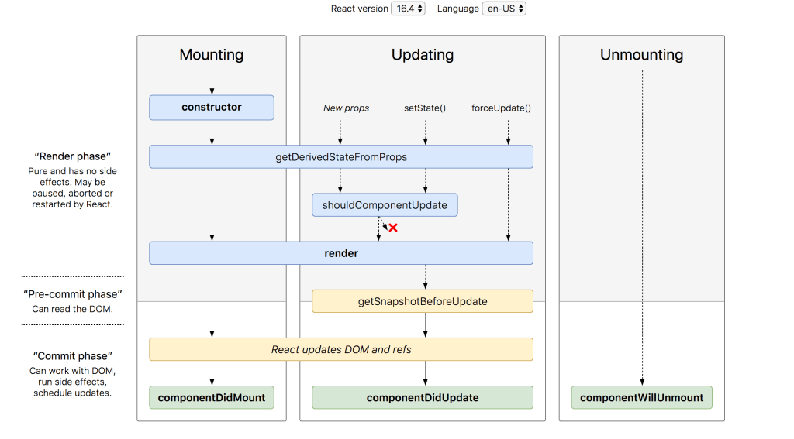

# _React: Component Lifecycle Events_

 
## Reading Question

 ### Based off the diagram, what happens first, the ‘render’ or the ‘componentDidMount’?
 *‘render’.*
 
 

 ### What is the very first thing to happen in the lifecycle of React?
*Constructor.*

### Put the following things in the order that they happen: componentDidMount, render, constructor, componentWillUnmount, React Updates.

1- constructor.
2- render.
3- componentDidMount.
4- React Updates.
5- componentWillUnmount.

### What does componentDidMount do?

*ComponentDidMount is This method is invoked immediately after a component is mounted.*

## Videos Question

### What types of things can you pass in the props?
*props pass Data in one direction.*

### What is the big difference between props and state?
_props are handled data in parant component and you need to update it in parent and use it in child component, whereas state is quite the opposite, its handled inside the component and you update it there_

### When do we re-render our application?
_When the user interactively changes the state, the app will re-render to show the new updates._

### What are some examples of things that we could store in state?
_the flag of submmit button._

