# Basics of HTML, CSS & JS

## Text
### **Headings and paragraphs**

- **Headings**

*HTML has six "levels" of headings:*
- *<h1> is used for main headings*
- *<h2> is used for subheadings*
- *If there are further sections under the subheadings then the <h3> element is used, and so on...*

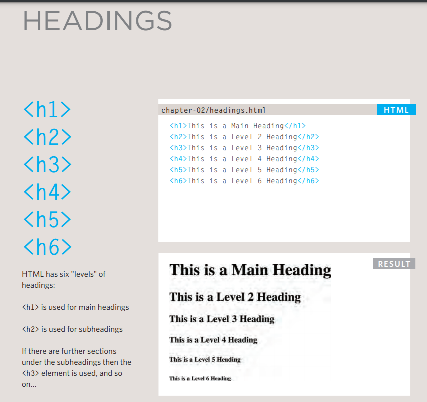
======================================================

 **paragraphs**

*To create a paragraph, surround the words that make up the paragraph with an opening 
 tag and closing 
 tag.*

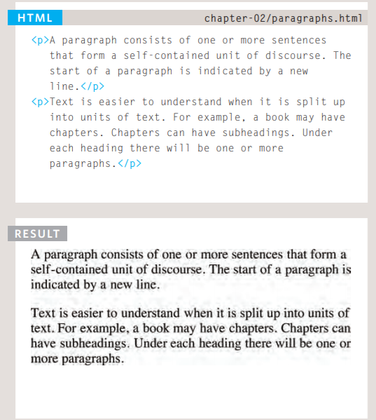

**Bold, italic, emphasis**

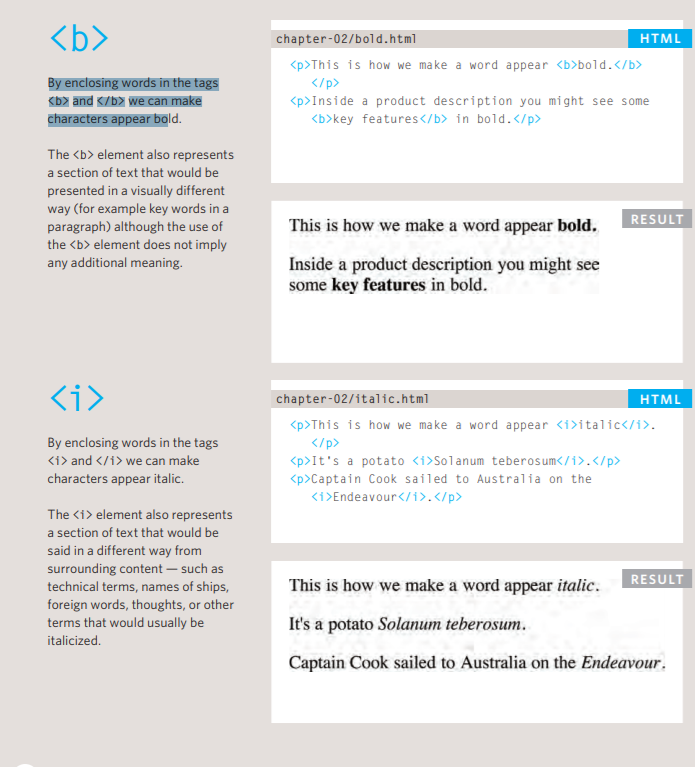

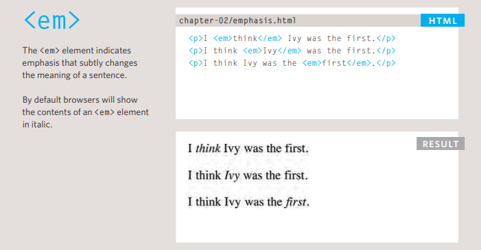

**Structural and semantic markup**

- **Structural markup**: *the elements that you can use to describe both headings and paragraphs*
- **Semantic markup**:*: which provides extra information; such as where emphasis is placed in a sentence, that something you have written is a quotation (and who said it), the meaning of acronyms, and so on*

## Summary TEXT
- *HTML elements are used to describe the structure of the page (e.g. headings, subheadings, paragraphs).*
- *They also provide semantic information (e.g. where emphasis should be placed, the definition of any acronyms used, when given text is a quotation).*

--------------------------------------------------------------------------------

# Introducing CSS
*CSS allows you to create rules that specify how the content of an element should appear. For example, you can specify that the background of the page is cream, all paragraphs should appear in gray using the Arial typeface, or that all level one headings should be in a blue, italic, Times typeface.*

**How does CSS actually work?**

*When a browser displays a document, it must combine the document's content with its style information. It processes the document in a number of stages, which we've listed below. Bear in mind that this is a very simplified version of what happens when a browser loads a webpage, and that different browsers will handle the process in different ways.*

**Rules, properties, and values**

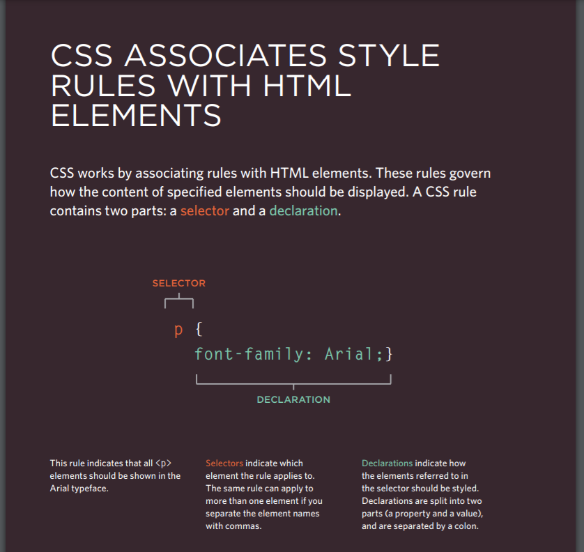

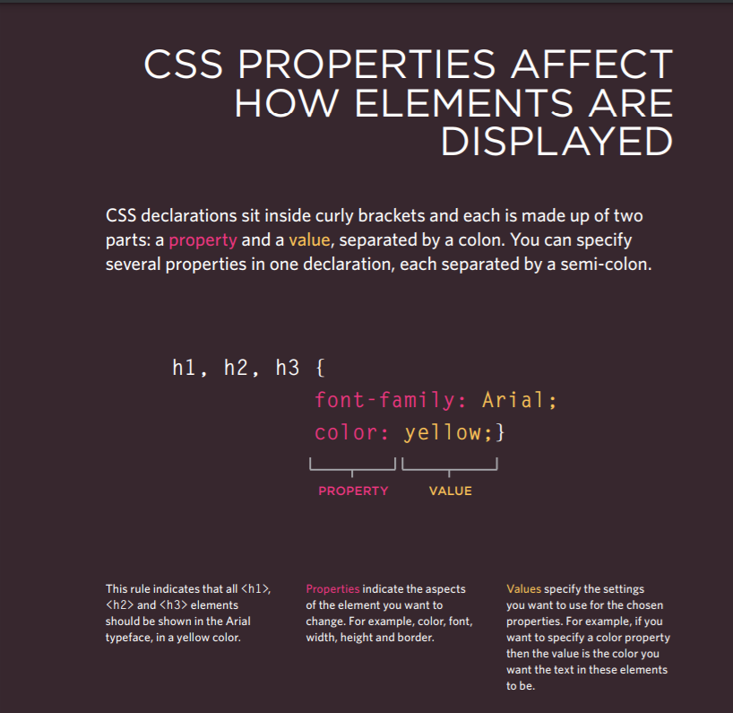

## Summary INTRODUCING CSS

- *CSS treats each HTML element as if it appears inside its own box and uses rules to indicate how that element should look.*
- *Rules are made up of selectors (that specify the elements the rule applies to) and declarations (that indicate what these elements should look like).*
- *Different types of selectors allow you to target your rules at different elements.*
- *Declarations are made up of two parts: the properties of the element that you want to change, and the values of those properties. For example, the font-family property sets the choice of font, and the value arial specifies Arial as the preferred typeface.*
- *CSS rules usually appear in a separate document, although they may appear within an HTML page.*

-------------------------------------------------------------------------------------

-------------------------------------------------------------------------------------

# Basic JavaScript Instructions

## STATEMENTS
*A script is a series of instructions that a computer can follow one-by-one. Each individual instruction or step is known as a statement. Statements should end with a semicolon.*

### Example

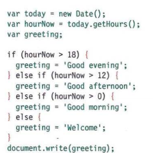

### COMMENTS

*You should write comments to explain what your code does. They help make your code easier to read and understand. This can help you and others who read your code.*

### Example 
##### // Create a ne1~ dat e object
##### /\* SGS SDGDSGDS DFGDFG \*/ 
----------------
## WHAT IS A VARIABLE?

A script will have to temporarily
store the bits of information it
needs to do its job. It can store this
data in variables.

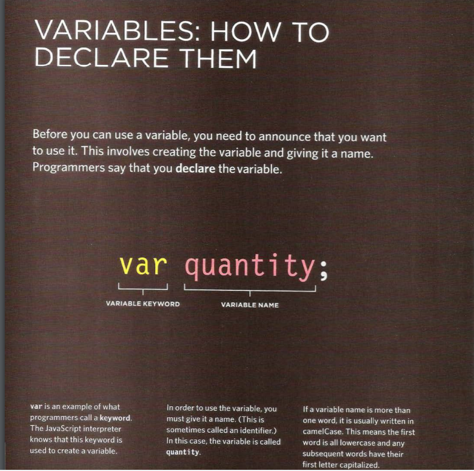

**USING A VARIABLE TO STORE A NUMBER**

*Note that the numbers are not written inside quotation marks.*

price = 5;

quantity = 14; 

**USING A VARIABLE TO STORE A NUMBER STRING**

*Note how the string is placed inside quote marks.*

 username = 'Molly';

message = 'See our upcoming range'; 

**USING A VARIABLE TO STORE A BOOLEAN**

*A Boolean variable can only have a value of true or fa 1 se, but this data type is very helpful.*

inStock = true;

shipping= false; 

**RULES FOR NAMING VARIABLES**

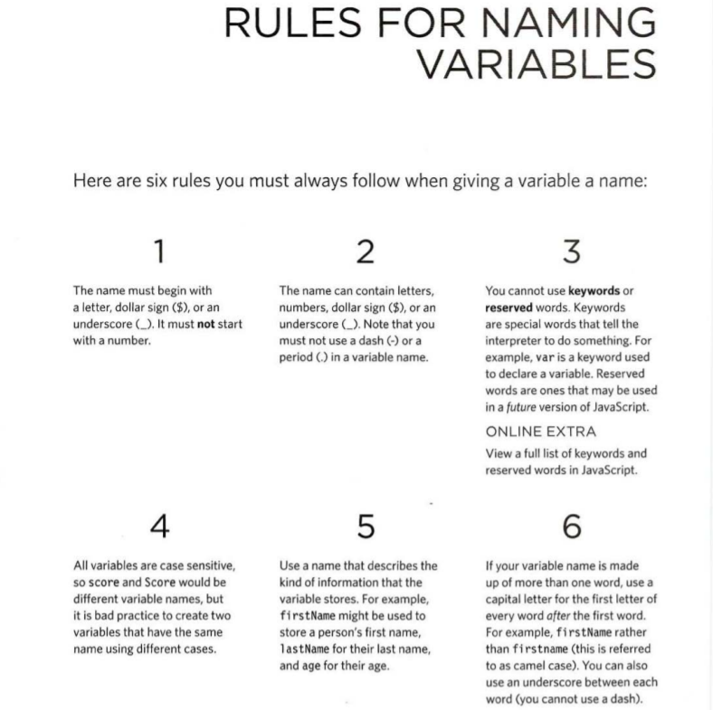

## VALU ES IN ARRAYS 

Values in an array are accessed as if they are in
a numbered list. It is important to know that the
numbering of this list starts at zero (not one)

## OPERATORS 

Expressions rely on things called operators; they allow programmers to
create a single value from one or more values. 

1. ASSIGNMENT OPERATORS
Assign a value to a variable
color = 'beige';
2. COMPARISON OPERATORS
Compare two values and return true or fa 1 se
buy = 3 > 5; 
3. ARITHMETIC OPERATORS
Perform basic math
area = 3 * 2; 
4. LOGICAL OPERATORS
Combine expressions and return true or fa 1 se
buy= (5 > 3) && (2 < 4);
5. STRING OPERATORS
Combine two strings
greeting= 'Hi 1 + 'Mol ly';

### Summary Basic JavaScript Instructions

-*A script is made up of a series of statements. Each statement is like a step in a recipe.*
-*Scripts contain very precise instructions. For example, you might specify that a value must be remembered before creating a calculation using that value.*
-*Variables are used to temporarily store pieces of information used in the script.*
-*Arrays are special types of variables that store more than one piece of related information.*
-*JavaScript distinguishes between numbers (0-9), strings (text), and Boolean values (true or false).*
-*Expressions evaluate into a single value.*
-*Expressions rely on operators to calculate a value.*

--------------------------------------------------------------------------

# Decisions and Loops

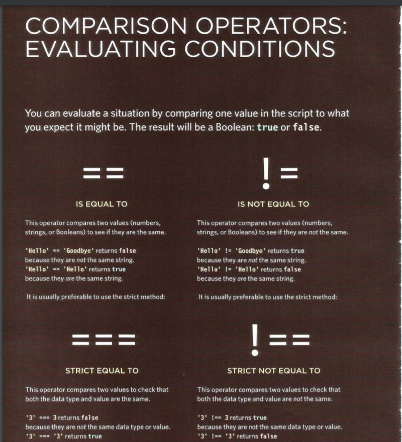

**USING COMPARISON OPERATORS**

var comparison= (score!+ score2) > (highScorel + highScore2); 

----------------------

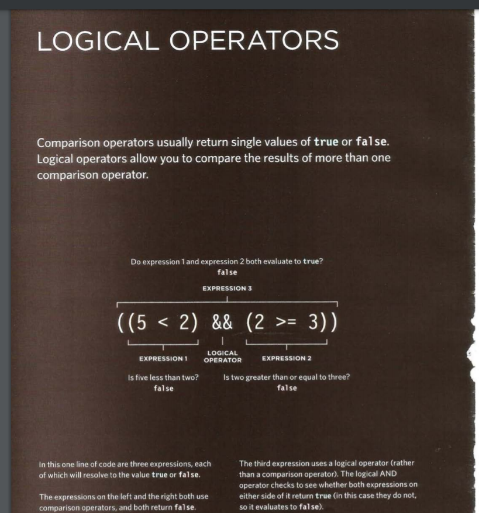

### USING LOGICAL AND

var passBoth = (scorel >= passl) && (score2 >= pass2); 

USING LOGICAL OR & LOGICAL NOT

var minPass = ((scorel >= passl) || (score2 >= pass2)); 

var msg = 'Resit required: ' + !(minPass); 

## IF Statements

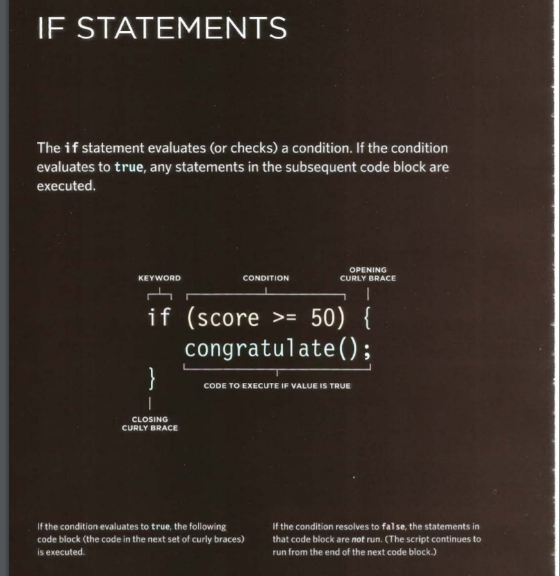

**USING IF STATEMENTS**

var score 75; \\\ Score

var msg; \\\Message

if (score>= 50) { \\\ If score is 50 or higher

msg = 'Congratulations!';

msg += ' Proceed to the next round . ' ;

var el = document.getElementByld('answer ' ) ;

el .textContent = msg; 

