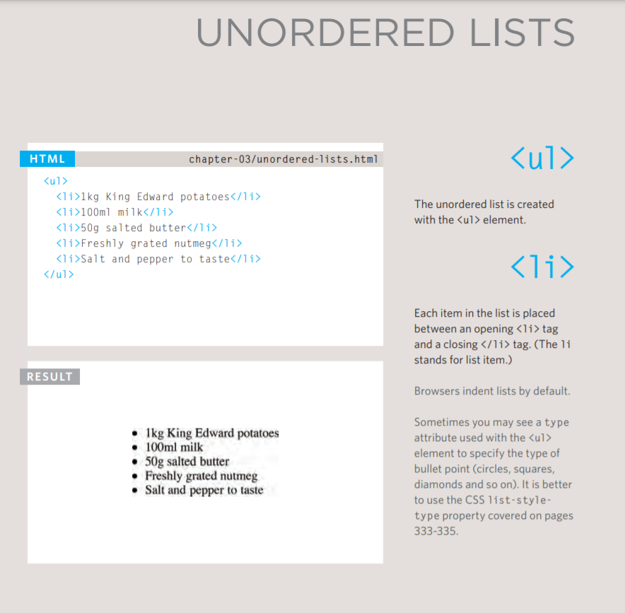

# Lists

- ***Ordered lists*** *are lists where each item in the list is numbered. For example, the list might be a set of steps for a recipe that must be performed in order, or a legal contract where each point needs to be identified by a section number.*

**Example**

- ***Unordered lists*** *are lists that begin with a bullet point (rather than characters that indicate order).*

**Example**

- ***Definition lists*** *are made up of a set of terms along with the definitions for each of those terms.*

**Example**

**Example of Nested Lists**

#### Summary LISTS
- There are three types of HTML lists: ordered,
- unordered, and definition.
- Ordered lists use numbers.
- Unordered lists use bullets.
- Definition lists are used to define terminology.
- Lists can be nested inside one another.

----------------------------------------------------

# Boxes

**Controlling size of boxes**

_By default a box is sized just big enough to hold its contents. To set your own dimensions for a box you can use the height and width properties._

**Box model for borders, margin and padding**
**Displaying and hiding boxes**

