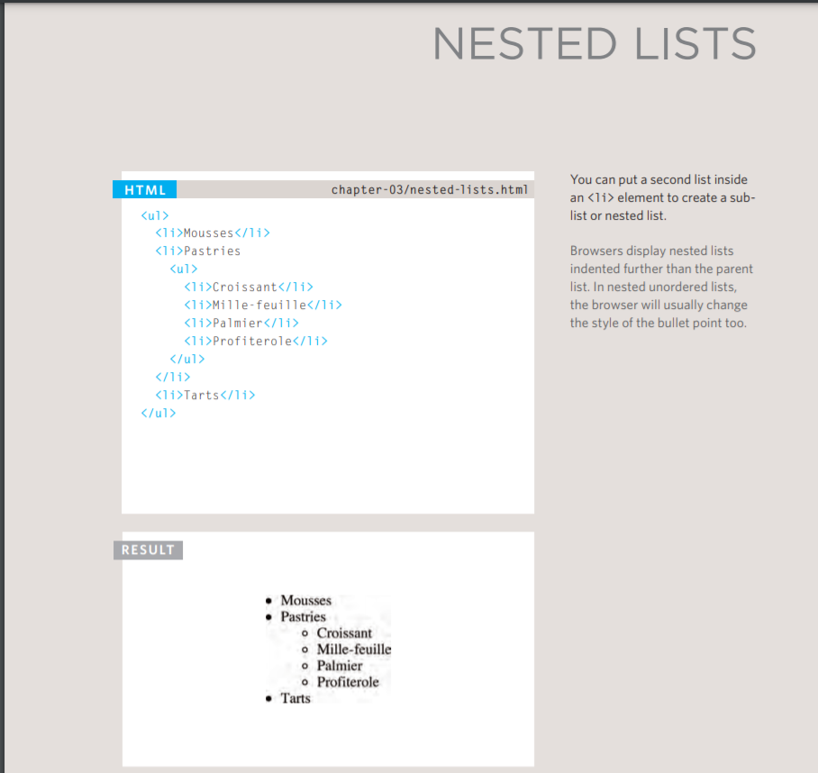
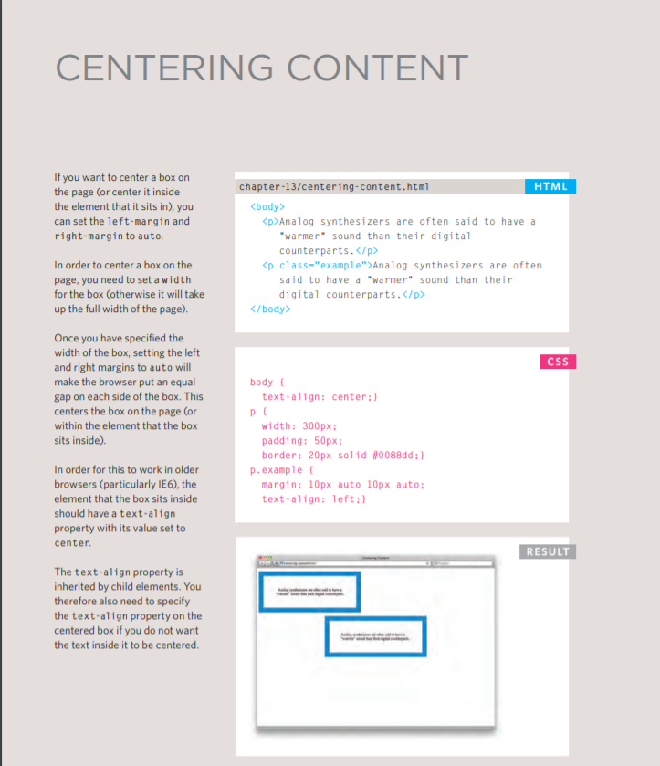

# Lists

- ***Ordered lists*** *are lists where each item in the list is numbered. For example, the list might be a set of steps for a recipe that must be performed in order, or a legal contract where each point needs to be identified by a section number.*

**Example**

- ***Unordered lists*** *are lists that begin with a bullet point (rather than characters that indicate order).*

**Example**

- ***Definition lists*** *are made up of a set of terms along with the definitions for each of those terms.*

**Example**

**Example of Nested Lists**

#### Summary LISTS
- There are three types of HTML lists: ordered,
- unordered, and definition.
- Ordered lists use numbers.
- Unordered lists use bullets.
- Definition lists are used to define terminology.
- Lists can be nested inside one another.

----------------------------------------------------

# Boxes

**Controlling size of boxes**

_By default a box is sized just big enough to hold its contents. To set your own dimensions for a box you can use the height and width properties._

**Control Box Dimention** 
the dimention of box can be change by Width & Height:

**Box model for borders, margin and padding**

**Displaying and hiding boxes**

control of position pf element

- Like Centering Content

-------------------------------------------------------------------------------------------

# Bacic JavaScript Instruction 

### STATEMENTS

- A script is a series of instructions that a computer can follow one-by-one.
- Each individual instruction or step is known as a statement.
- Statements should end with a semicolon. 

### COMMENTS

- You should write comments to explain what your code does.
- They help make your code easier to read and understand.
- This can help you and others who read your code. 

#### MULTI-LINE COMMENTS

 /* Comment */

 #### SINGLE-LINE COMMENTS 

 // Comment

 ## Variables

#### Declear a Variable

#### Assign a Vaeiable

 **DATA TYPES**

 NUMERIC DATA TYPE : The numeric data type handles numbers.

 STRING DATA TYPE  :  The strings data type consists of letters and other characters.

 BOOLEAN DATA TYPE  : Boolean data types can have one of two values: true or false. 

 ### RULES FOR NAMING VARIABLES

-------------------------------------------------------------------

## USING IF STATEMENTS

## USING ELESE IF STATEMENTS

## SWITCH STATEMENTS

## TRUTHY & FALSY VALUES 

 

