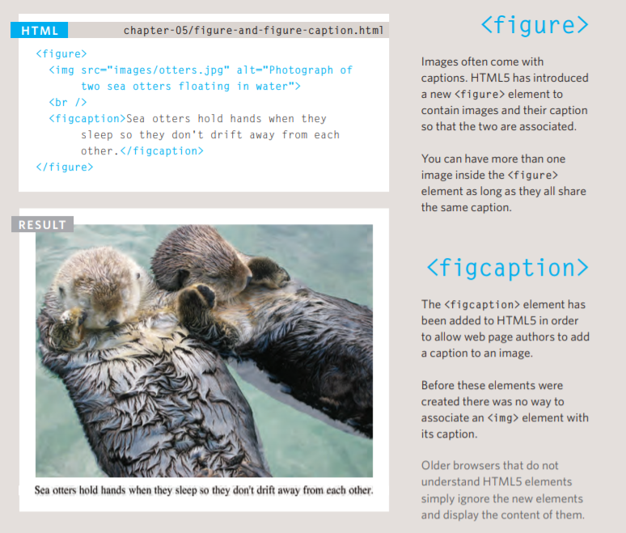
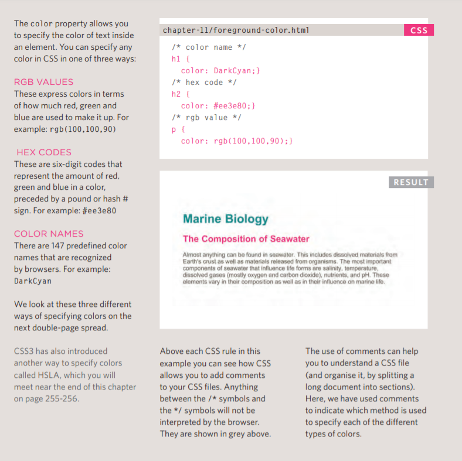
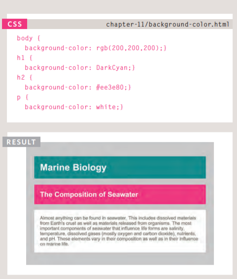
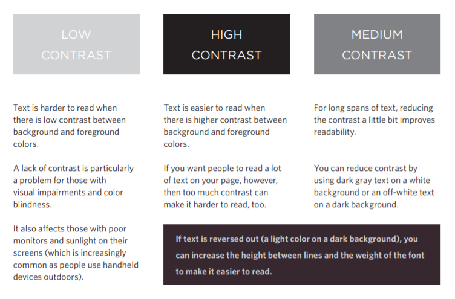
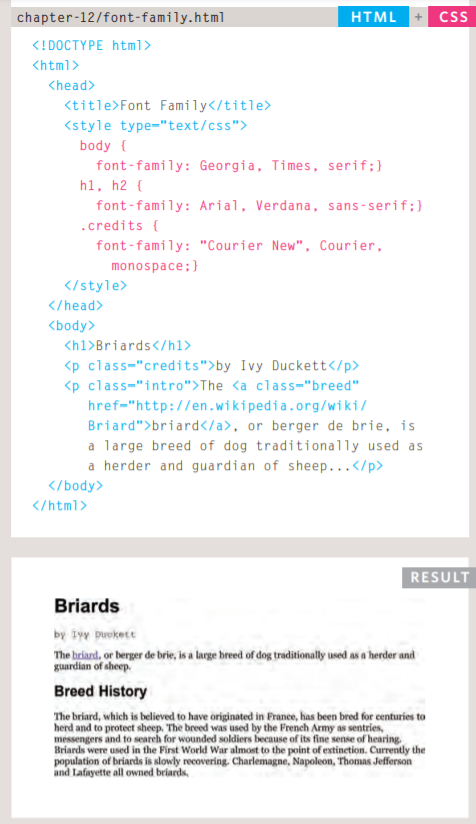
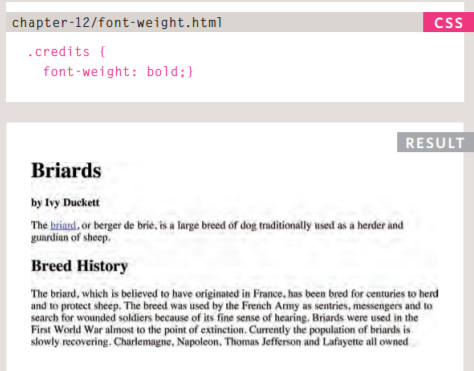
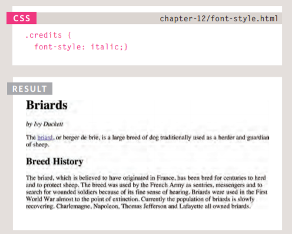
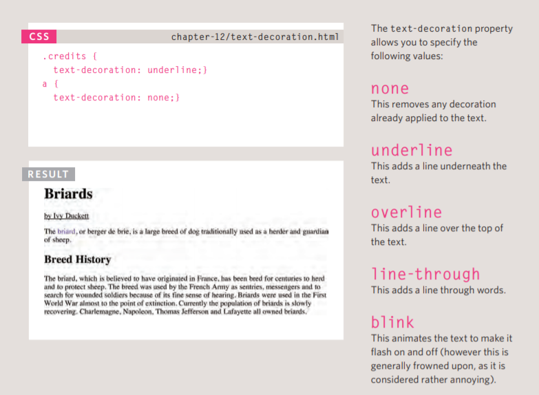
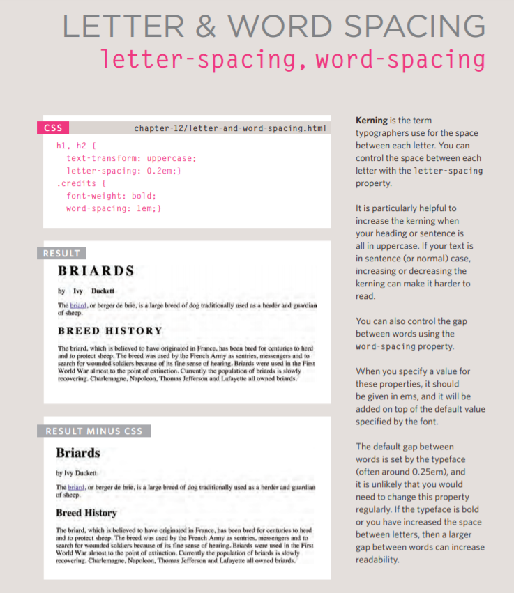

# Images

## How to add images to pages

**Adding Images**
`To add an image into the page you need to use an  element. This is an empty element (which means there is no closing tag). It must carry the following two attributes: src & alt`

## Height & Width of Images
- height This specifies the height of theimage in pixels.

- width This specifies the width of the image in pixels.

## Figure and Figure Caption

### Summary Images
- `The  element is used to add images to a web page.`
- You must always specify a src attribute to indicate the
source of an image and an alt attribute to describe the
content of an image.
- You should save images at the size you will be using
them on the web page and in the appropriate format.
- Photographs are best saved as JPEGs; illustrations or
logos that use flat colors are better saved as GIFs.
--------------------------------------------------------

# Color

**How to specify colors**

- Foreground Color

- Background Color
`background-color`

- contrast

When picking foreground and background
colors, it is important to ensure that there is
enough contrast for the text to be legible.

### Summary COLOER

- Color not only brings your site to life, but also helps
convey the mood and evokes reactions.
- There are three ways to specify colors in CSS:
RGB values, hex codes, and color names.
- Color pickers can help you find the color you want.
- It is important to ensure that there is enough contrast
between any text and the background color (otherwise
people will not be able to read your content).
- CSS3 has introduced an extra value for RGB colors to
indicate opacity. It is known as RGBA.
- CSS3 also allows you to specify colors as HSL values,
with an optional opacity value. It is known as HSLA.

----------------------------------------------------------

# Text

### Specifying Typefaces
`font-family`

### Bold, italics, underlines

- Bold 
`font-weight`

- Italics

`font-style`

- Underline & Strike
`text-decoration`

- Spacing between lines, words, and letters

----------------------------------------------------------------

# JPEG vs PNG vs GIF

Use JPEG format for all images that contain a natural scene or photograph where variation in colour and intensity is smooth. Use PNG format for any image that needs transparency or for images with text & objects with sharp contrast edges like logos. Use GIF format for images that contain animations.

## JPEG
is a lossy compression specification that takes advantage of human perception. It can achieve compression ratios of 1:10 without any perceivable difference in quality. Beyond this, the compression artefacts become more prominent. 

## PNG

is a lossless image format using DEFLATE compression. No data is lost during compression and no compression artefacts are introduced in the image. For this reason, a PNG image would retain higher quality than an image than JPEG and would look a lot sharper, it would also occupy more space on the disk. This makes it unsuitable for storing or transferring high-resolution digital photographs but a great choice for images with text, logos and shapes with sharp edges.

## GIF
is also a lossless image format that uses LZW compression algorithm. It was favoured over PNG for simple graphics in websites in its early days because the support of PNG was still growing. Given that PNG is now supported across all major devices and that PNG compression is about 5–25% better than GIF compression, GIF images are now mainly used only if the image contains animations.