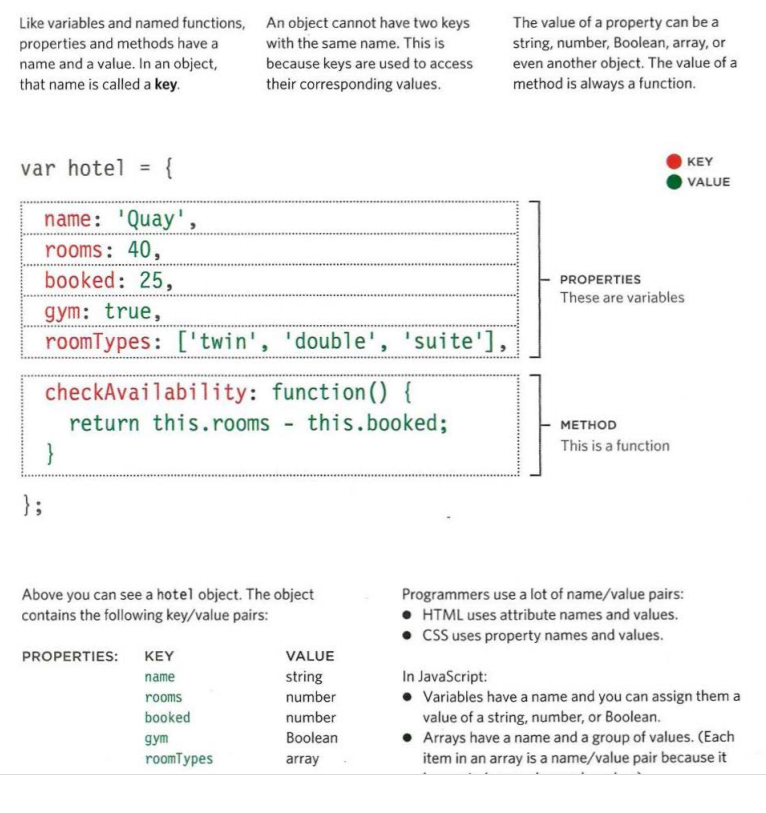
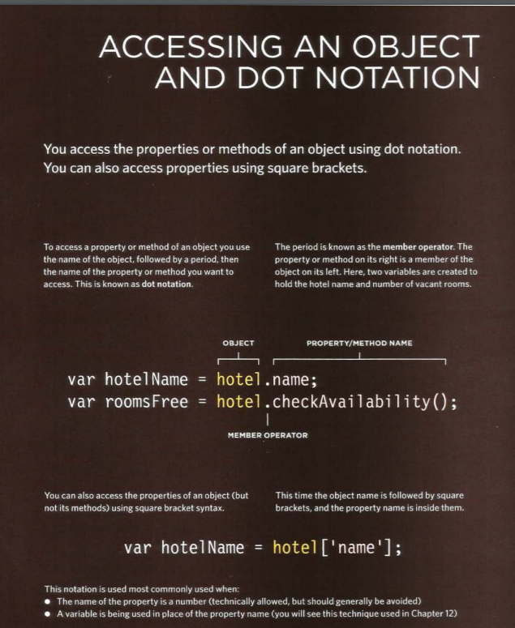
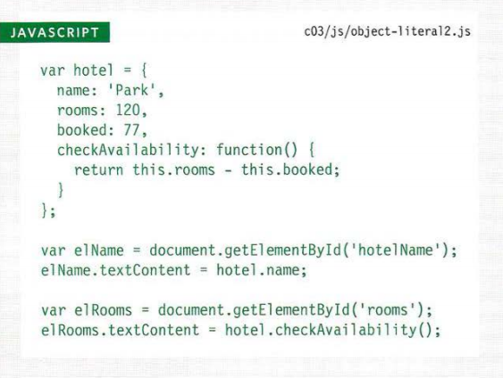
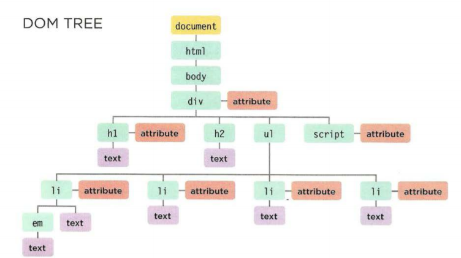
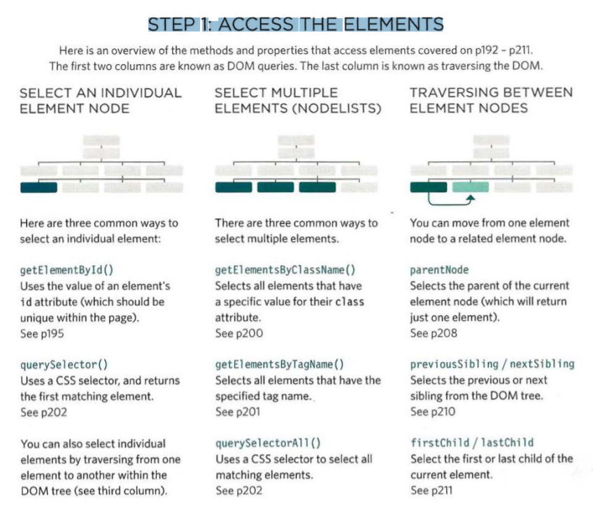
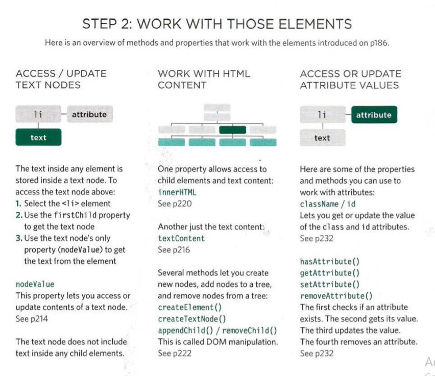
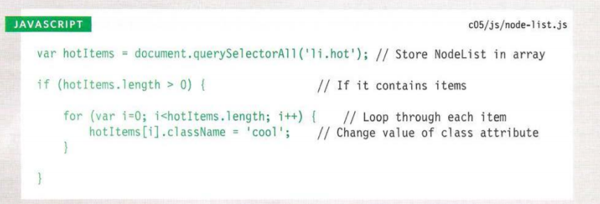
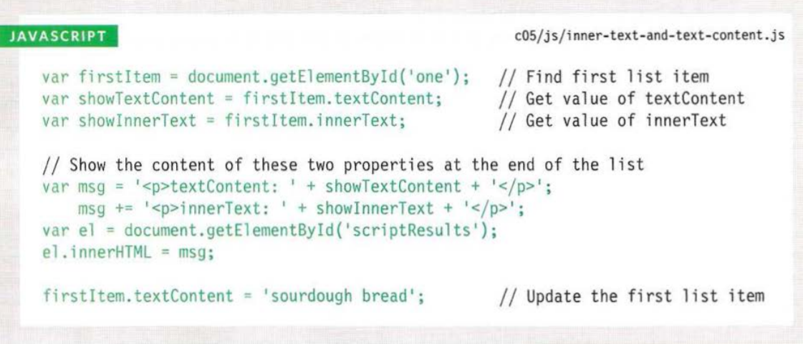
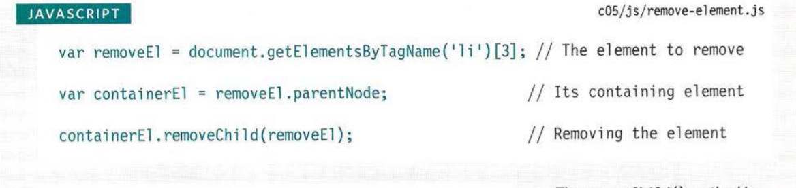

# Understanding The Problem Domain Is The Hardest Part Of Programming
### A familiar problem
* Very simple functionality, easily explainable, but most importantly, easily understood.
By creating a familiar problem domain, I found that both the tasks of me teaching a new technology and the viewer learning that technology were much easier, because it is very difficult to learn more than one thing at once.Simply that by taking away the problem domain, or making it so trivial that it is easily understood, I am able to make both teaching and learning easier.

### Why problem domains are hard
- Writing code is a lot like putting together a jigsaw puzzle.  We put together code with the purpose of building components that we have taken out of the “bigger picture” of the problem domain.

- The big issue is that many problem domains are like a puzzle with a blurry picture or no picture at all.

### Programming is easy if you understand the problem domain
- Make the problem domain easier. 

You can often make the problem domain easier by cutting out cases and narrowing your focus to a particular part of the problem.

= Get better at understanding the problem domain.

Best to resist the temptation to “not waste anymore time talking” and make sure you understand a problem inside and out before you try and solve it with code.

--------------------------------------------------------------------------------------------------------------------------------

# WHAT IS AN OBJECT? 

**Objects group together a set of variables and functions to create a model of a something you would recognize from the real world. In an object, variables and functions take on new names.**

- IN AN OBJECT: VARIABLES BECOME KNOWN AS PROPERTIES.
- IN AN OBJECT: FUNCTIONS BECOME KNOWN AS METHODS .

### This object represents a hotel. It has five properties and one method. The object is in curly braces. It is stored in a variable called hotel

#### accessing the object

#### CREATING MORE OBJECT LITERALS

--------------------------------------------------------------------------------

# Document Object Model

### THE DOM TREE IS A MODEL OF A WEB PAGE 
As a browser loads a web page, it creates a model of that page.
The model is called a DOM tree, and it is stored in the browsers' memory.
It consists of four main types of nodes. 

### DOM TREE 

Each node is an object with methods and properties.
Scripts access and update this DOM tree (not the source HTML file).
Any changes made to the DOM tree are reflected in the browser. 

## WORKING WITHTHE DOM TREE

- Accessing and updating the DOM tree involves two steps:
1. Locate the node that represents the element you want to work with. 
2. Use its text content, child elements, and attributes. 

### STEP 1: ACCESS THE ELEMENTS

### STEP 2: WORK W ITH THOSE ELEMENTS 

### METHODS THAT RETURN A SINGLE ELEMENT NODE:

- `gitElementById('name of id');`
- `querySel ector( 1 css selector'); `

### METHODS THAT RETURN ONE OR MORE ELEMENTS (AS A NODELIST)
- `getEl ementsByClassName( 1 class 1 );`

- `getEl ementsByTagName( 1 tagName 1)`

- `querySelectorAll ( 1 css select or•);`

### LOOPING THROUGH A NODELIST

### ACCESSING TEXT ONLY

### REMOVING AN ELEMENT FROM THE DOM TREE 

### Summary

- The browser represents the page using a DOM tree. 
-DOM trees have four types of nodes: document nodes,
element nodes, attribute nodes, and text nodes. 
-You can select element nodes by their id or cl ass
attributes, by tag name, or using CSS selector syntax. 
-Whenever a DOM query can return more than one
node, it will always return a Nadel i st. 
-From an element node, you can access and update its
content using properties such as textContent and
i nnerHTML or using DOM manipulation techniques. 

-An element node can contain multiple text nodes and
child elements that are siblings of each other
-In older browsers, implementation of the DOM is
inconsistent (and is a popular reason for using jQuery). 

-Browsers offer tools for viewing the DOM tree.

