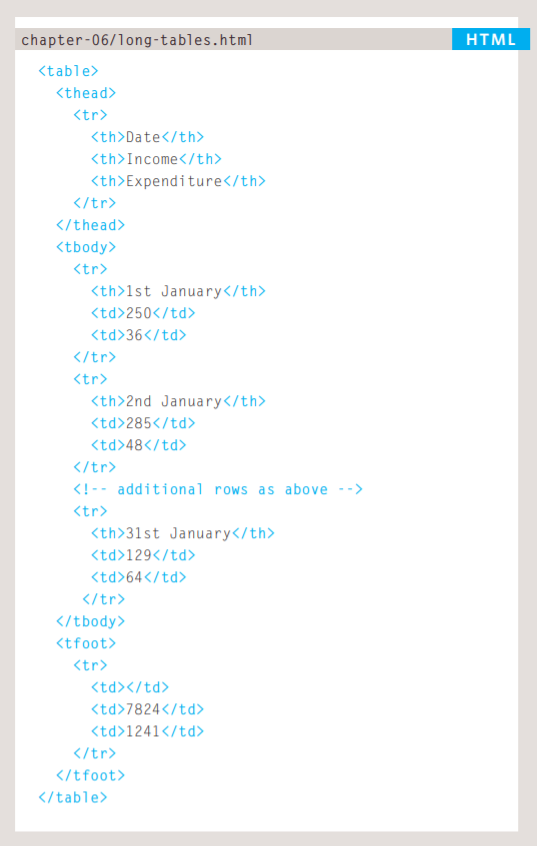

# Domain Modeling
Domain modeling is the process of creating a conceptual model in code for a specific problem. A model describes the various entities, their attributes and behaviors, as well as the constraints that govern the problem domain. An entity that stores data in properties and encapsulates behaviors in methods is commonly referred to as an object-oriented model.

### Define a constructor and initialize properties

To define the same properties between many objects, you'll want to use a constructor function. Below is a table that summarizes a JavaScript representation of an `EpicFailVideo` object.

| Property     | Data              | Type    |
|--------------|-------------------|---------|
| `epicRating` | `1` to `10`       | Number  |
| `hasAnimals` | `true` or `false` | Boolean |

Here's an implementation of the `EpicFailVideo` constructor function.

```javascript
let EpicFailVideo = function(epicRating, hasAnimals) {
  this.epicRating = epicRating;
  this.hasAnimals = hasAnimals;
}

let parkourFail = new EpicFailVideo(7, false);
let corgiFail = new EpicFailVideo(4, true);

console.log(parkourFail);
console.log(corgiFail);
```


### Calculate daily Likes

Popularity of a video is measured in Likes. And the formula for calculating Likes is the number of viewers times the percentage of viewers who'll Like a video. In other words, **viewers times percentage**.

To calculate the number of viewers per day, generate a random number between 10 and 30 and then multiply it by the epic rating of that video.

| Random number | Epic rating | Viewers per day |
|---------------|-------------|-----------------|
| 10            | 10          | 100             |
| 20            | 9           | 180             |
| 30            | 8           | 240             |

The percentage of viewers who'll Like a video depends on whether or not the video contains animals.

| Animals | Percentage |
|---------|------------|
| Yes     | 75%        |
| No      | 40%        |

With this knowledge in hand, let's model the number daily Likes an epic fail video will receive.

```javascript
var EpicFailVideo = function(epicRating, hasAnimals) {
  this.epicRating = epicRating;
  this.hasAnimals = hasAnimals;
}

EpicFailVideo.prototype.generateRandom = function(min, max) {
  return Math.floor(Math.random() * (max - min + 1)) + min;
}

EpicFailVideo.prototype.dailyLikes = function() {
  var viewers, percentage;

  viewers = this.generateRandom(10, 30) * this.epicRating;

  if (this.hasAnimals) {
    percentage = 0.75;
  } else {
    percentage = 0.40;
  }

  return Math.round(viewers * percentage);
}

var parkourFail = new EpicFailVideo(7, false);
var corgiFail = new EpicFailVideo(4, true);

console.log(parkourFail.dailyLikes());
console.log(corgiFail.dailyLikes());
```

----------------------------------------------------------------------


### Summary

Domain modeling is the process of creating a conceptual model for a specific problem. And a domain model that's articulated well can verify and validate your understanding of that problem.

Here's some tips to follow when building your own domain models.

1. When modeling a single entity that'll have many instances, build self-contained objects with the same attributes and behaviors.
1. Model its attributes with a constructor function that defines and initializes properties.
1. Model its behaviors with small methods that focus on doing one job well.
1. Create instances using the `new` keyword followed by a call to a constructor function.
1. Store the newly created object in a variable so you can access its properties and methods from **outside**.
1. Use the `this` variable within methods so you can access the object's properties and methods from **inside**.`


------------------------------------
# Tables

### How to create tables


## `<table>`
The `<table>` element is used
to create a table. The contents
of the table are written out row
by row.


## `<tr>`
You indicate the start of each
row using the opening `<tr>` tag.
(The tr stands for table row.)
It is followed by one or more
`<td>` elements (one for each cell
in that row).
At the end of the row you use a
closing `</tr>` tag.

## `<td>`

Each cell of a table is
represented using a <td>
element. (The td stands for
table data.)
At the end of each cell you use a
closing </td> tag.


## Table Headings


- `<th>`

- The <th> element is used just
like the <td> element but its
purpose is to represent the
heading for either a column or
a row. (The th stands for table
heading.) 
- Using <th> elements for
headings helps people who
use screen readers, improves
the ability for search engines
to index your pages, and also
enables you to control the
appearance of tables better
when you start to use CSS.


## Long Tables




## `<thead>`
The headings of the table should
sit inside the <thead> element.

## `<tbody>`

The body should sit inside the
<tbody> element.

## `<tfoot>`

The footer belongs i


## Summary


- The <table> element is used to add tables to a web
page.
- A table is drawn out row by row. Each row is created
with the <tr> element.
- Inside each row there are a number of cells
represented by the <td> element (or <th> if it is a
header).
- You can make cells of a table span more than one row
or column using the rowspan and colspan attributes.
- For long tables you can split the table into a <thead>,
<tbody>, and <tfoot>.
-----------------------------------------------------------------

# Functions, Methods, and Objects

### CREATING OBJECTS USING CONSTRUCTOR SYNTAX


### CREATE & ACCESS OBJECTS CONSTRUCTOR NOTATION


### ADDING AND REMOVING PROPERTIES


### RECAP: WAYS TO CREATE OBJECTS 


### RECAP: STORING DATA
In JavaScript, data is represented using name/value pairs.
To organize your data, you can use an array or object to group a set of
related values. In arrays and objects the name is also known as a key. 


### USING THE DOCUMENT OBJECT


**DATA TYPES REVISITED**

In JavaScript there are six data types:
Five of them are described as simple (or primitive) data types.
The sixth is the object (and is referred to as a complex data type). 


- #### SIMPLE OR PRIMITIVE DATA TYPES Like:

1. String
2. Number
3. Boolean
4. Undefined


- #### COMPLEX DATA TYPE

- 0bject
ARRAYS ARE OBJECTS
As you saw on p118, an array is a set of key/value
pairs (just like any other object). But you do not
specify the name in the key/value pair of an array - it
is an index number. 


#### GLOBAL OBJECTS: DATE OBJECT (AND TIME) 


## Sumary

- Functions allow you to group a set of related
statements together that represent a single task.

- Functions can take parameters (informatiorJ required
to do their job) and may return a value.

- An object is a series of variables and functions that
represent something from the world around you.

- In an object, variables are known as properties of the
object; functions are known as methods of the object.

- Web browsers implement objects that represent both
the browser window and the document loaded into the
browser window.

- JavaScript also has several built-in objects such as
String, Number, Math, and Date. Their properties and
methods offer functionality that help you write scripts.

- Arrays and objects can be used to create complex data
sets (and both can contain the other). 


