# form
*The best known form on the web is probably the search box that sits right in the middle of Google's homepage.*

## Form Controls
There are several types of form controls that
you can use to collect information from visitors
to your site.

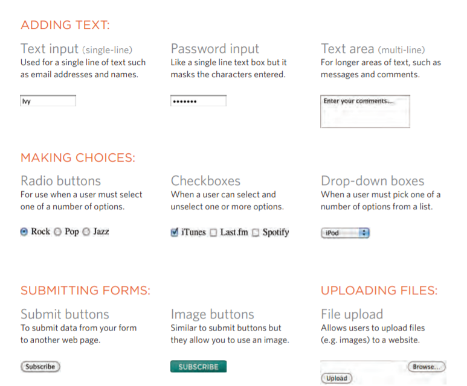

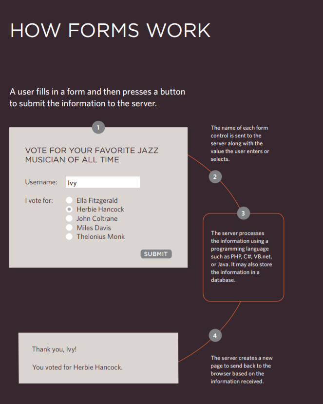
## How Forms Work
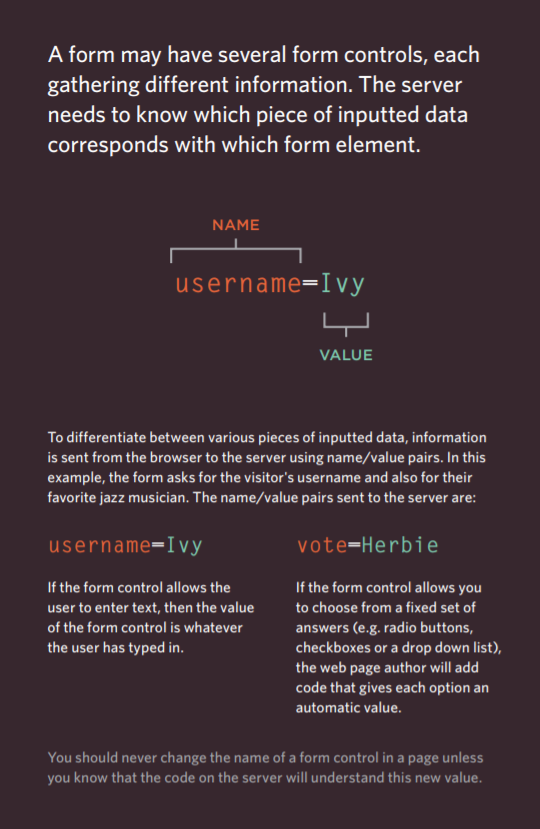

### Form Structure
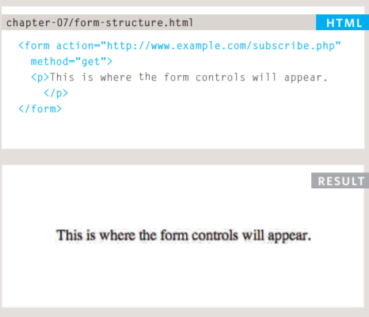

`<form>`
Form controls live inside a
`<form>` element. This element
should always carry the action
attribute and will usually have a
method and id attribute too.

### Text Input

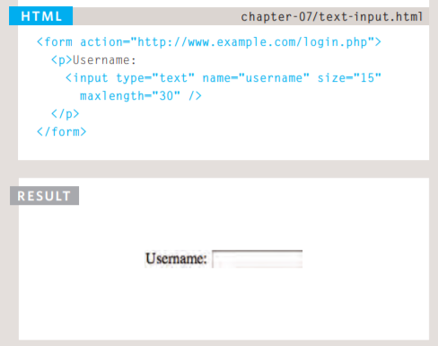

`<input>`
The `<input>` element is used
to create several different form
controls. The value of the type
attribute determines what kind
of input they will be creating.

`type="text"`
When the type attribute has a
value of text, it creates a singleline text input.

`name`
When users enter information
into a form, the server needs to
know which form control each
piece of data was entered into.
(For example, in a login form, the
server needs to know what has
been entered as the username
and what has been given as the
password.) Therefore, each form
control requires a name attribute.
The value of this attribute
identifies the form control and is
sent along with the information
they enter to the server.

`size`
The size attribute should not
be used on new forms. It was
used in older forms to indicate
the width of the text input
(measured by the number of
characters that would be seen)

`maxlength`
You can use the maxlength
attribute to limit the number
of characters a user may enter
into the text field. Its value is the
number of characters they may
enter. For example, if you were
asking for a year, the maxlength
attribute could have a value of 4.

## Submit Button

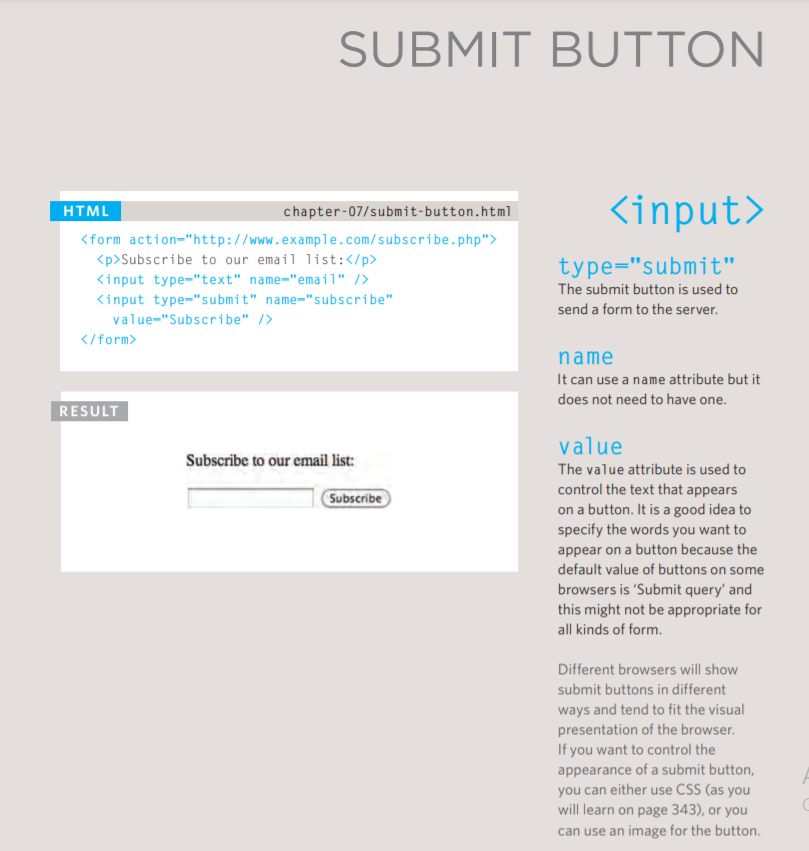

## Image Button

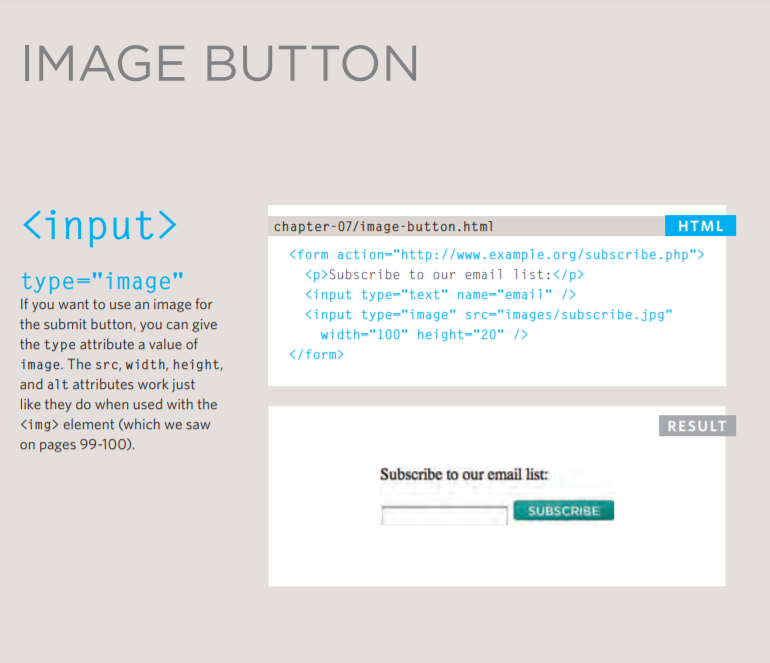

## Grouping Form Elements

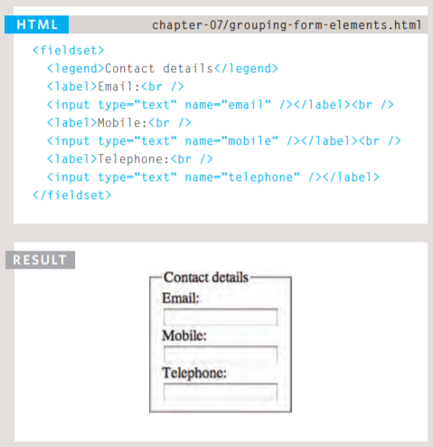

- `<fieldset>`

You can group related form
controls together inside the
`<fieldset>` element. This is
particularly helpful for longer
forms.
Most browsers will show the
fieldset with a line around
the edge to show how they are
related. The appearance of these
lines can be adjusted using CSS.

- `<legend>`

The `<legend>`element can
come directly after the opening
`<fieldset>` tag and contains a
caption which helps identify the
purpose of that group of form
controls.

## Summary FORMS

- Whenever you want to collect information from
visitors you will need a form, which lives inside a
`<form>` element.

- Information from a form is sent in name/value pairs.
- Each form control is given a name, and the text the
user types in or the values of the options they select
are sent to the server.
- HTML5 introduces new form elements which make it
easier for visitors to fill in forms.

--------------------------------------------------------------------------------

# Lists, Tables & Forms

### Bullet Point Styles
***_list-style-type_***

The list-style-type property
allows you to control the shape
or style of a bullet point (also
known as a marker).
It can be used on rules that
apply to the `<ol>`, `<ul>`, and`<li>`
elements.

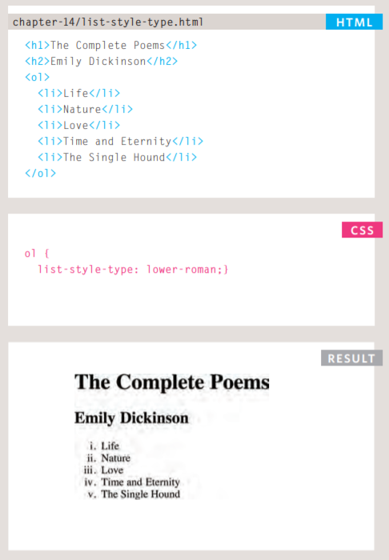

### Positioning the Marker
***list-style-position***
Lists are indented into the page
by default and the list-styleposition property indicates
whether the marker should
appear on the inside or the
outside of the box containing the
main points.
This property can take one of
**two values:**

**outside**
The marker sits to the left of the
block of text. (This is the default
behaviour if this property is not
used.)

**inside**

The marker sits inside the box of
text (which is indented).

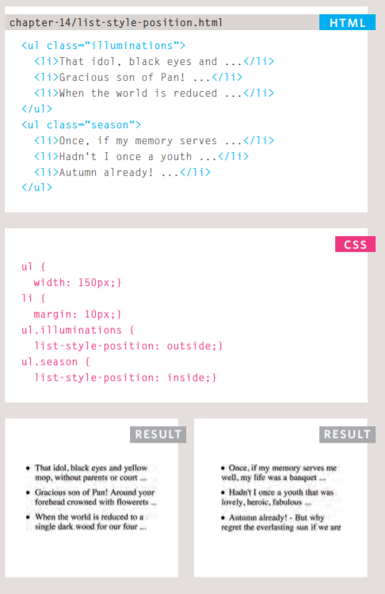

## Table Properties

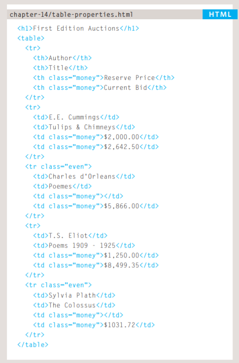

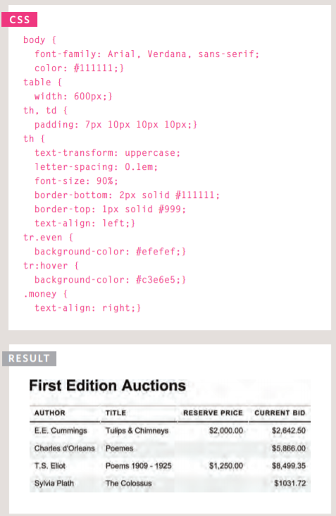

## Styling Forms

### Styling Text Inputs
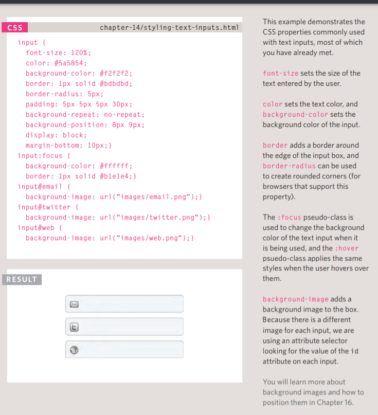

### Styling Submit Buttons
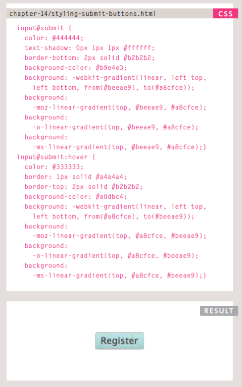

### Styling Fieldsets & Legends
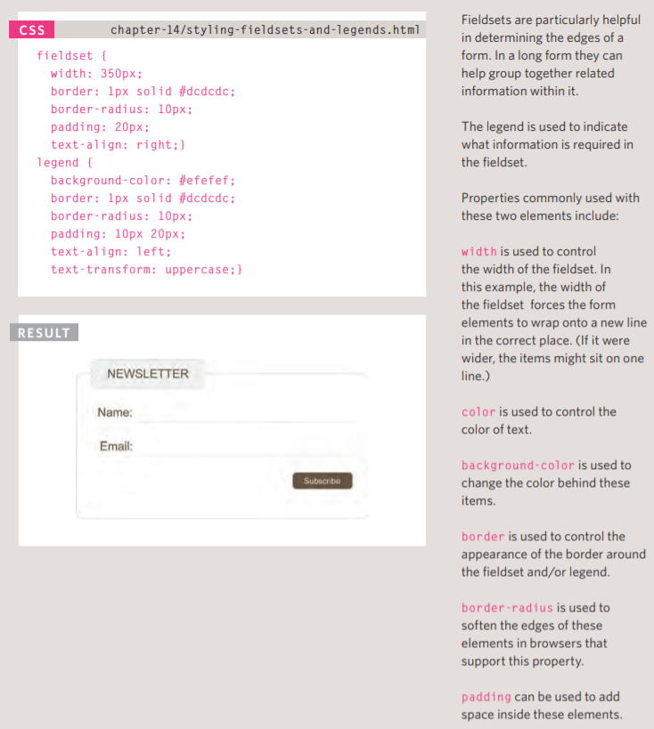

## Summary LISTS, TABLES AND FORMS

- In addition to the CSS properties covered in other
chapters which work with the contents of all elements,
there are several others that are specifically used to
control the appearance of lists, tables, and forms.
- List markers can be given different appearances
using the list-style-type and list-style image
properties.
- Table cells can have different borders and spacing in
different browsers, but there are properties you can
use to control them and make them more consistent.
- Forms are easier to use if the form controls are
vertically aligned using CSS.
- Forms benefit from styles that make them feel more
interactive.

----------------------------------------------------------------------------

----------------------------------------------------------------------------

# Events

## DIFFERENT EVENT TYPES

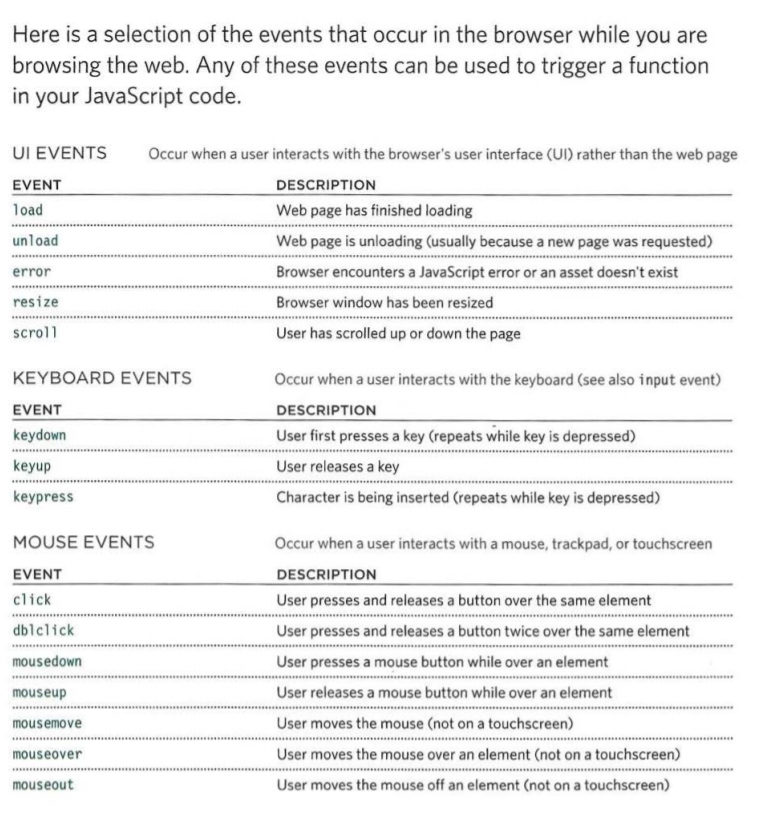

## HOW EVENTS TRIGGER JAVASCRIPT CODE 

1. Select t he element
node(s) you want the
script to respond to.
For example, if you want to
trigger a function when a user
clicks on a specific link, you need
to get the DOM node for that
link element. You do this using a
DOM query (see Chapter 5). 
2. Indicate which event on
the selected node(s) will
trigger the response.
Programmers call this binding an
event to a DOM node.
The previous two pages showed
a selection of the popular events
that you can monitor for.

3. State the code you want
to run when the event
occurs.
W hen the event occurs, on a
specified element, it will trigger
a function. This may be a named
or an anonymous function. 

## TRADITIONAL DOM EVENT HANDLERS 

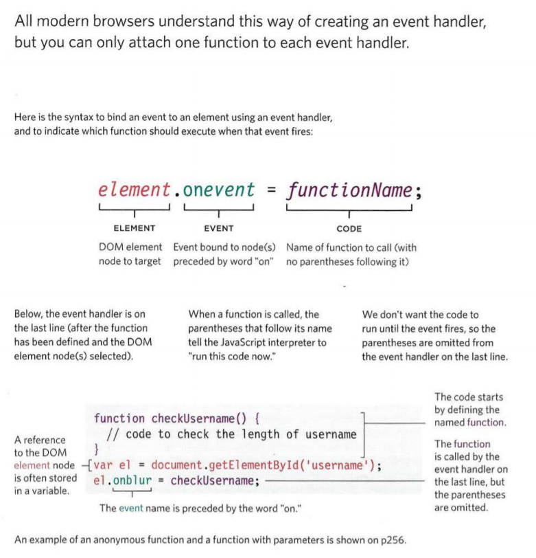

## EVENT LISTENERS

Event listeners are a more recent approach to handling events.
They can deal with more than one function at a time
but they are not supported in older browsers. 
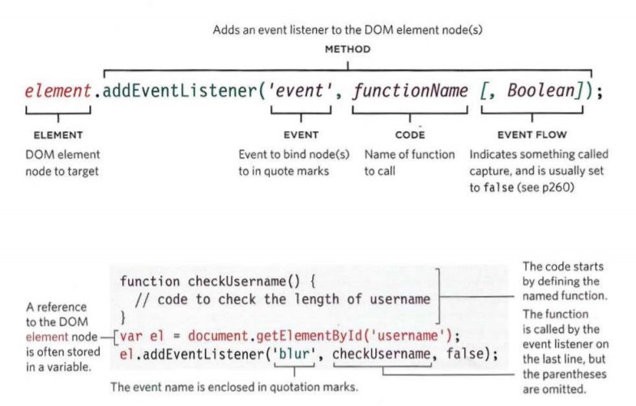

## USING EVENT DELEGATION

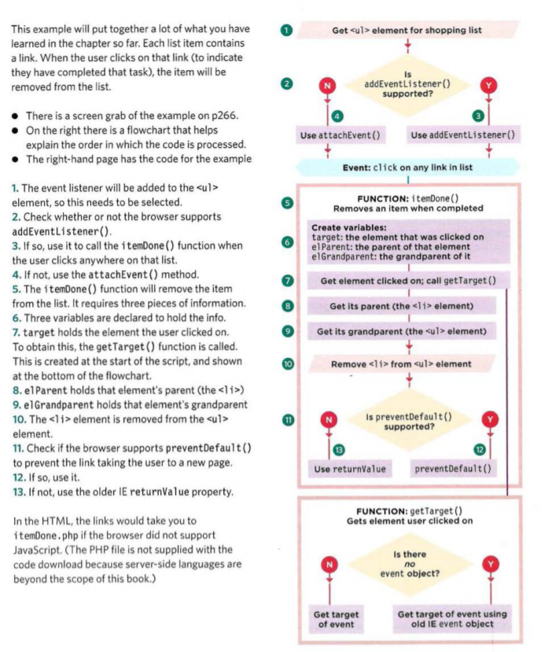

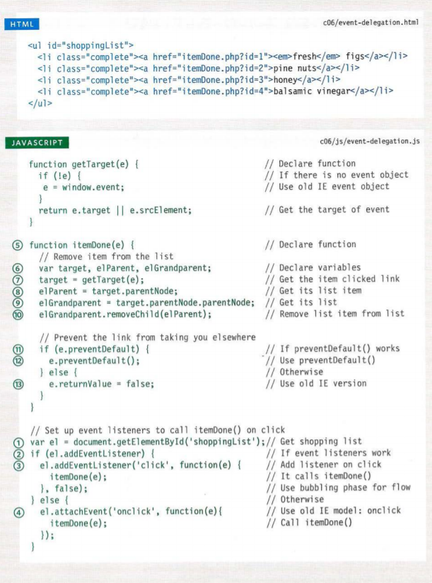

## USING HTMLS EVENTS
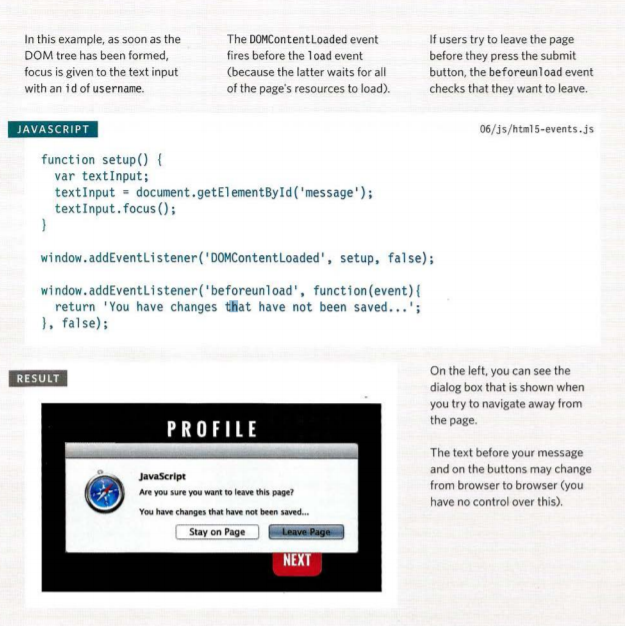

## SUMMARY EVENTS

- Events are the browser's way of indicating when
something has happened (such as when a page has
finished loading or a button has been clicked).

- Binding is the process of stating which event you are
waiting to happen, and which element you are waiting
for that event to happen upon.

- When an event occurs on an element, it can trigger a
JavaScript function. When this function then changes
the web page in some way, it feels interactive because
it has responded to the user.

- You can use event delegation to monitor for events
that happen on all of the children of an element.

- The most commonly used events are W3C DOM
events, although there are others in the HTMLS
specification as well as browser-specific events. 

