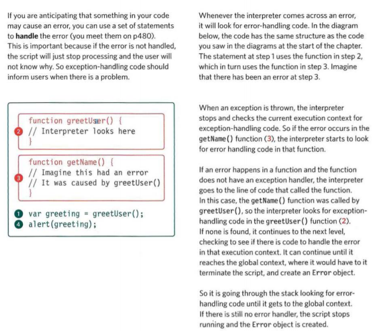
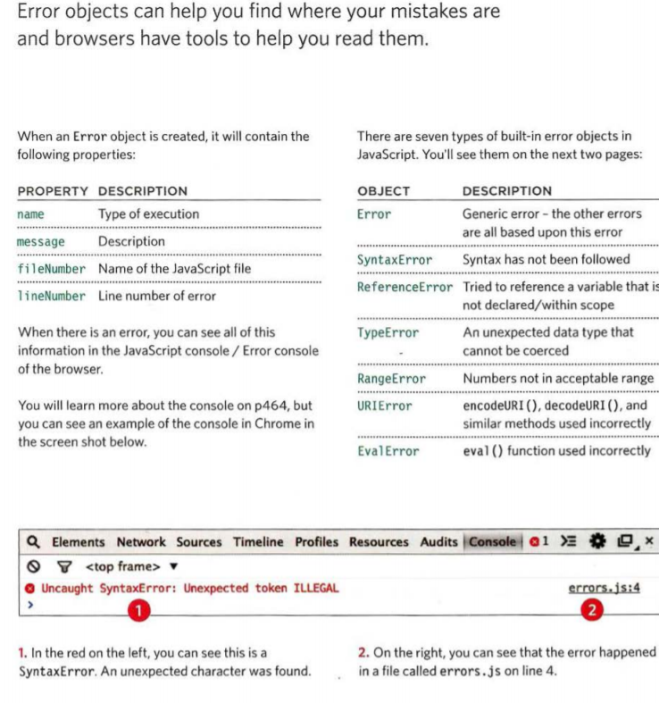
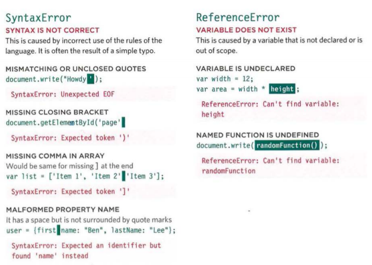
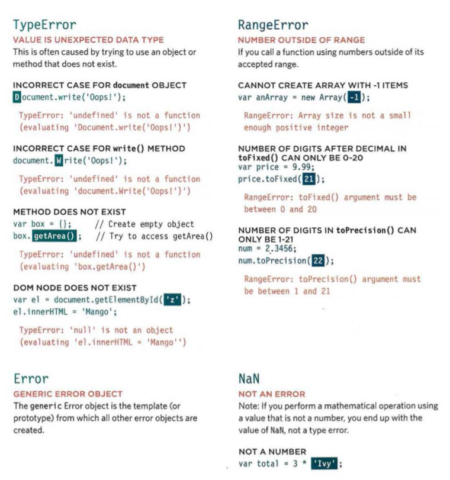
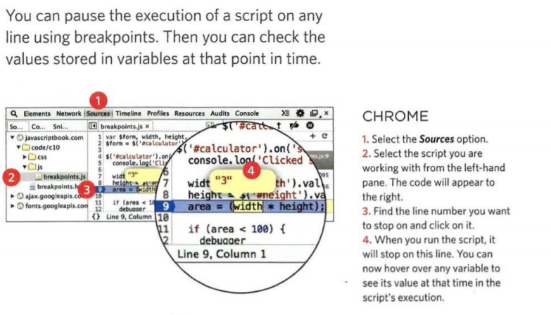
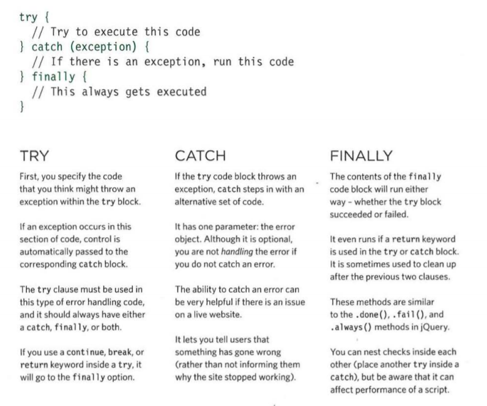
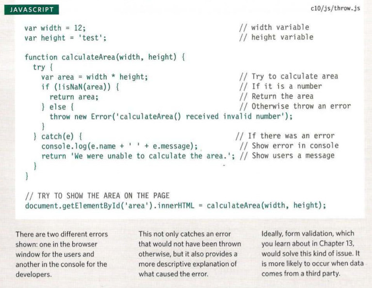
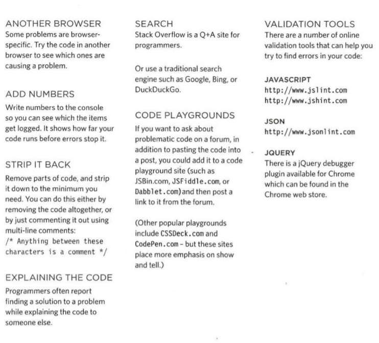
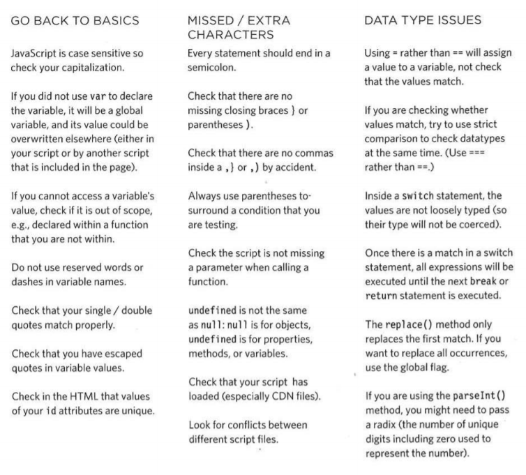

# Error Handling & Debugging

### UNDERSTANDING SCOPE

In the interpreter, each execution context has its own va ri ables object.
It holds the variables, functions, and parameters available within it.
Each execution context can also access its parent's v a ri ables object. 

### UNDERSTANDING ERRORS
If a JavaScript statement generates an error, then it throws an exception.
At that point, the interpreter stops and looks for exception-handl ing code. 
 
### ERROR OBJECTS 
Error objects can help you find where your mistakes are
and browsers have tools to help you read them. 
 
### ERROR OBJECTS CONTINUED 

 
 

### HOW TO DEAL WITH ERRORS

1. DEBUG THE SCRIPT TO FIX ERRORS

If you come across an error while writing a script
(or when someone reports a bug), you will need to
debug the code, track down the source of the error,
and fix it.
You will find that the developer tools available in
every major modern browser will help you with
this task. In this chapter, you will learn about the
developer tools in Chrome and Firefox. (The tools in
Chrome are identical to those in Opera.)
IE and Safari also have their own tools (but there is
not space to cover them all). 

2. HANDLE ERRORS GRACEFULLY

You can handle errors gracefully using try, catch,
throw, and f i na 1 ly statements.
Sometimes, an error may occur in the script for a
reason beyond your control. For example, you might
request data from a third party, and their server
may not respond. In such cases, it is particularly
important to write error-handling code.
In the latter part of the chapter, you will learn how to
gracefully check whether something will work, and
offer an alternative option if it fails. 

### HOW TO LOOK AT ERRORS IN CHROME 

The console will show you when there is an
error in your JavaScript. It also displays the line
where it became a problem for the interpreter. 

1. The Console option is selected.
2. The type of error and the error
message are shown in red.
3. The file name and the line
number are shown on the
right-hand side of the console.

### BREAKPOINTS 
 
### HANDLING EXCEPTIONS 
If you know your code might fail, use try, catch, and finally.
Each one is given its own code block. 
 

### THROW ERROR FOR NaN
 

### DEBUGGING TIPS
 
### COMMON ERRORS 

 

# SUMMARY Error Handling & Debugging

- If you understand execution contexts (which have two
stages) and stacks, you are more likely to find the error
in your code.

- Debugging is the process of finding errors. It involves a
process of deduction.

The console helps narrow down the area in which the
error is located, so you can try to find the exact error.

- JavaScript has 7 different types of errors. Each creates
its own error object, which can tell you its line number
and gives a description of the error.

- If you know that you may get an error, you can handle
it gracefully using the try, catch, finally statements.
Use them to give your users helpful feedback. 
