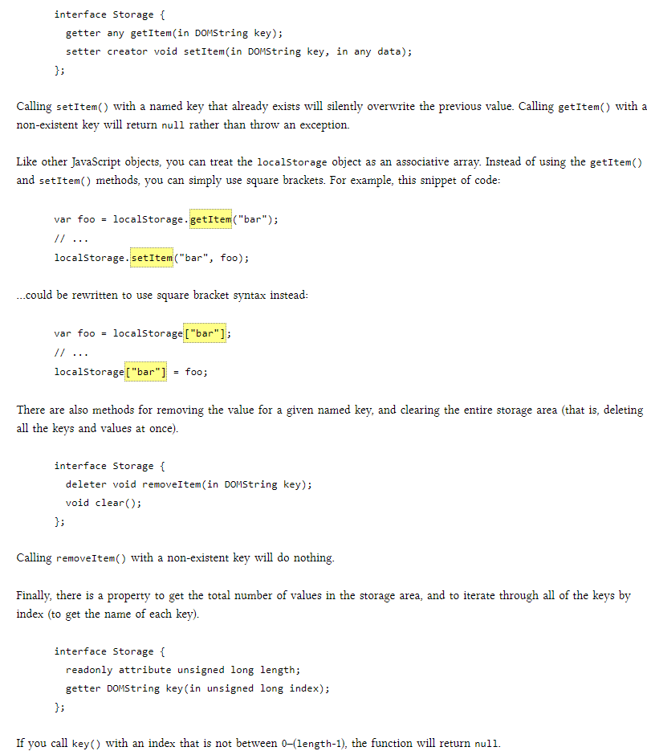
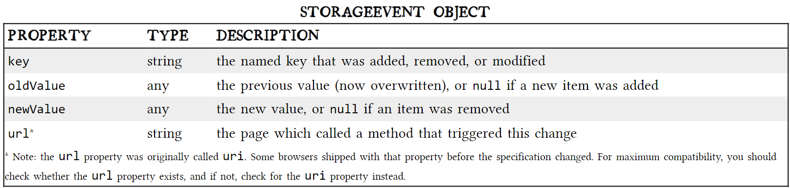

# Local Storage

**Historically**, web applications have had none of these luxuries. Cookies were invented early in the web’s history, and indeed they can be used for persistent local storage of small amounts of data. But they have three potentially dealbreaking downsides:

- Cookies are included with every HTTP request, thereby slowing down your web application by needlessly transmitting the same data over and over

- Cookies are included with every HTTP request, thereby sending data unencrypted over the internet (unless your entire web application is served over SSL)

- Cookies are limited to about 4 KB of data — enough to slow down your application (see above), but not enough to be terribly useful

We really want is
- a lot of storage space
- on the client
- that persists beyond a page refresh
- and isn’t transmitted to the server

### A BRIEF HISTORY OF LOCAL STORAGE HACKS BEFORE HTML5

In the beginning, there was only Internet Explorer. Or at least, that’s what Microsoft wanted the world to think. To that end, as part of the First Great Browser Wars, Microsoft invented a great many things and included them in their browser-to-end-all-browser-wars, Internet Explorer. One of these things was called DHTML Behaviors, and one of these behaviors was called userData.

**userData** allows web pages to store up to 64 KB of data per domain, in a hierarchical XML-based structure. (Trusted domains, such as intranet sites, can store 10 times that amount. And hey, 640 KB ought to be enough for anybody.) IE does not present any form of permissions dialog, and there is no allowance for increasing the amount of storage available.

**In 2002** Adobe introduced a feature in Flash 6 that gained the unfortunate and misleading name of “Flash cookies.” Within the Flash environment, the feature is properly known as Local Shared Objects. 

**In 2007**, Google launched Gears, an open source browser plugin aimed at providing additional capabilities in browsers. (We’ve previously discussed Gears in the context of providing a geolocation API in Internet Explorer.) Gears provides an API to an embedded SQL database based on SQLite. After obtaining permission from the user once, Gears can store unlimited amounts of data per domain in SQL database tables.

## INTRODUCING HTML5 STORAGE
 **HTML5 Storage**   it’s a way for web pages to store named key/value pairs locally, within the client web browser. Like cookies, this data persists even after you navigate away from the web site, close your browser tab, exit your browser, or what have you. Unlike cookies, this data is never transmitted to the remote web server (unless you go out of your way to send it manually). Unlike all previous attempts at providing persistent local storage, it is implemented natively in web browsers, so it is available even when third-party browser plugins are not.

## USING HTML5 STORAGE

HTML5 Storage is based on named key/value pairs. You store data based on a named key, then you can retrieve that data with the same key. The named key is a string. The data can be any type supported by JavaScript, including strings, Booleans, integers, or floats. However, the data is actually stored as a string. If you are storing and retrieving anything other than strings, you will need to use functions like parseInt() or parseFloat() to coerce your retrieved data into the expected JavaScript datatype.

## TRACKING CHANGES TO THE HTML5 STORAGE AREA

If you want to keep track programmatically of when the storage area changes, you can trap the storage event. The storage event is fired on the window object whenever setItem(), removeItem(), or clear() is called and actually changes something. For example, if you set an item to its existing value or call clear() when there are no named keys, the storage event will not fire, because nothing actually changed in the storage area.

`if (window.addEventListener) {
  window.addEventListener("storage", handle_storage, false);
} else {
  window.attachEvent("onstorage", handle_storage);
};`

The handle_storage callback function will be called with a StorageEvent object, except in Internet Explorer where the event object is stored in window.event.

`function handle_storage(e) {
  if (!e) { e = window.event; }
}`

### LIMITATIONS IN CURRENT BROWSERS

“5 megabytes” is how much storage space each origin gets by default. This is surprisingly consistent across browsers, although it is phrased as no more than a suggestion in the HTML5 Storage specification. One thing to keep in mind is that you’re storing strings, not data in its original format. If you’re storing a lot of integers or floats, the difference in representation can really add up. Each digit in that float is being stored as a character, not in the usual representation of a floating point number.

“QUOTA_EXCEEDED_ERR” is the exception that will get thrown if you exceed your storage quota of 5 megabytes. “No” is the answer to the next obvious question, “Can I ask the user for more storage space?” At time of writing (February 2011), no browser supports any mechanism for web developers to request more storage space. Some browsers (like Opera) allow the user to control each site’s storage quota, but it is purely a user-initiated action, not something that you as a web developer can build into your web application.

### HTML5 STORAGE IN ACTION

Let’s see HTML5 Storage in action. Recall the Halma game we constructed in the canvas chapter. There’s a small problem with the game: if you close the browser window mid-game, you’ll lose your progress. But with HTML5 Storage, we can save the progress locally, within the browser itself. Here is a live demonstration. Make a few moves, then close the browser tab, then re-open it. If your browser supports HTML5 Storage, the demonstration page should magically remember your exact position within the game, including the number of moves you’ve made, the position of each of the pieces on the board, and even whether a particular piece is selected.

`function saveGameState() {
    if (!supportsLocalStorage()) { return false; }
    localStorage["halma.game.in.progress"] = gGameInProgress;
    for (var i = 0; i < kNumPieces; i++) {
	localStorage["halma.piece." + i + ".row"] = gPieces[i].row;
	localStorage["halma.piece." + i + ".column"] = gPieces[i].column;
    }
    localStorage["halma.selectedpiece"] = gSelectedPieceIndex;
    localStorage["halma.selectedpiecehasmoved"] = gSelectedPieceHasMoved;
    localStorage["halma.movecount"] = gMoveCount;
    return true;
}`

On page load, instead of automatically calling a newGame() function that would reset these variables to hard-coded values, we call a resumeGame() function instead. Using HTML5 Storage, the resumeGame() function checks whether a state about a game-in-progress is stored locally. If so, it restores those values using the localStorage object.

`function resumeGame() {
    if (!supportsLocalStorage()) { return false; }
    gGameInProgress = (localStorage["halma.game.in.progress"] == "true");
    if (!gGameInProgress) { return false; }
    gPieces = new Array(kNumPieces);
    for (var i = 0; i < kNumPieces; i++) {
	var row = parseInt(localStorage["halma.piece." + i + ".row"]);
	var column = parseInt(localStorage["halma.piece." + i + ".column"]);
	gPieces[i] = new Cell(row, column);
    }
    gNumPieces = kNumPieces;
    gSelectedPieceIndex = parseInt(localStorage["halma.selectedpiece"]);
    gSelectedPieceHasMoved = localStorage["halma.selectedpiecehasmoved"] == "true";
    gMoveCount = parseInt(localStorage["halma.movecount"]);
    drawBoard();
    return true;
}`

### BEYOND NAMED KEY-VALUE PAIRS: COMPETING VISIONS

One vision is an acronym that you probably know already: SQL. In 2007, Google launched Gears, an open source cross-browser plugin which included an embedded database based on SQLite. This early prototype later influenced the creation of the Web SQL Database specification. Web SQL Database (formerly known as “WebDB”) provides a thin wrapper around a SQL database, allowing you to do things like this from JavaScript:

 **actual working code in 4 browsers**

 `openDatabase('documents', '1.0', 'Local document storage', 5*1024*1024, function (db) {
  db.changeVersion('', '1.0', function (t) {
    t.executeSql('CREATE TABLE docids (id, name)');
  }, error);
});`

**WEB SQL DATABASE SUPPORT :**

IE          .
FIREFOX  	.
SAFARI     4.0+
CHROME     4.0+
OPERA	  10.5+
IPHONE	   3.0+
ANDROID    2.0+

### FURTHER READING

**HTML5 storage:**

- HTML5 Storage specification
- Introduction to DOM Storage on MSDN
- Web Storage: easier, more powerful client-side data storage on Opera Developer Community
- DOM Storage on Mozilla Developer Center. (Note: most of this page is devoted to Firefox’s prototype implementation of a globalStorage object, a non-standard precursor to localStorage. Mozilla added support for the standard localStorage interface in Firefox 3.5.)
- Unlock local storage for mobile Web applications with HTML5, a tutorial on IBM DeveloperWorks

**Early work by Brad Neuberg et. al. (pre-HTML5):**

- Internet Explorer Has Native Support for Persistence?!?! (about the userData object in IE)
- Dojo Storage, part of a larger tutorial about the (now-defunct) Dojo Offline library
- dojox.storage.manager API reference
- dojox.storage Subversion repository        	

**Web SQL Database:**

- Web SQL Database specification
- Introducing Web SQL Databases
- Web Database demonstration
- persistence.js, an “asynchronous JavaScript ORM” built on top of Web SQL Database and Gears

**IndexedDB:**

- Indexed Database API specification
- Beyond HTML5: Database APIs and the Road to IndexedDB
- Firefox 4: An early walk-through of IndexedDB
