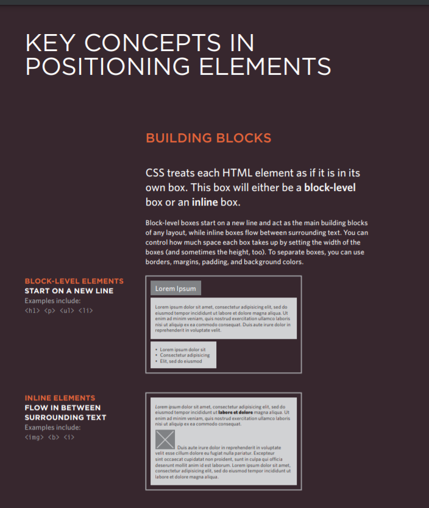

# Links

**Creating links between pages**

**Linking to other sites**

**Email links**

##Summary LINKS
- Links are created using the <'a'> element.
- The <'a'> element uses the href attribute to indicate the page you are linking to.
- If you are linking to a page within your own site, it is best to use relative links rather than qualified URLs.
- You can create links to open email programs with an email address in the "to" field.
- You can use the id attribute to target elements within a page that can be linked to.

-------------------------------------------------------------

# Layout

**Key Concepts in Positioning Elements**

**Containing Elements**
_If one block-level element sits inside another block-level element then the outer box is known as the containing or parent element._

**Controlling the Position of Elements**

--------------------------------------------------------------

