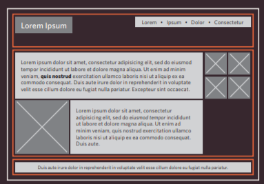
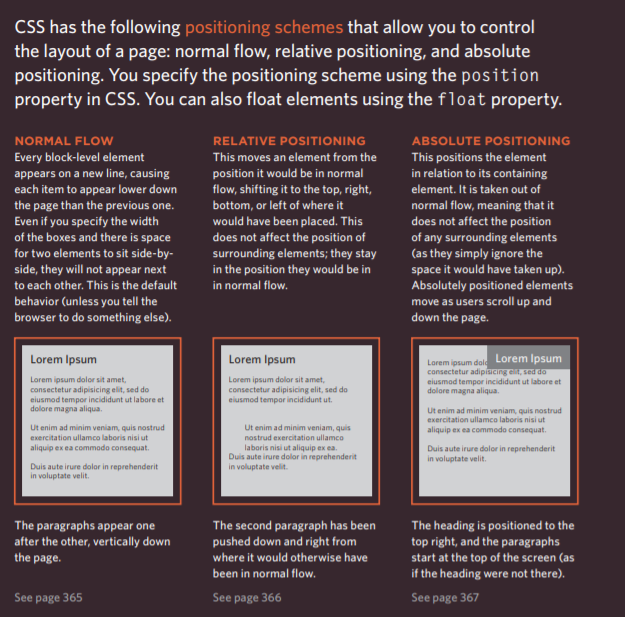
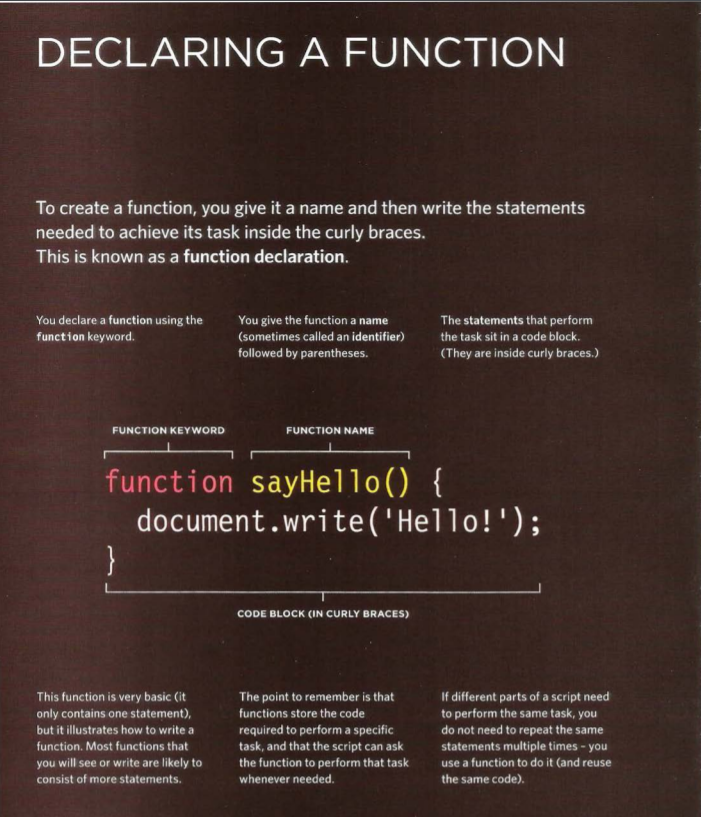
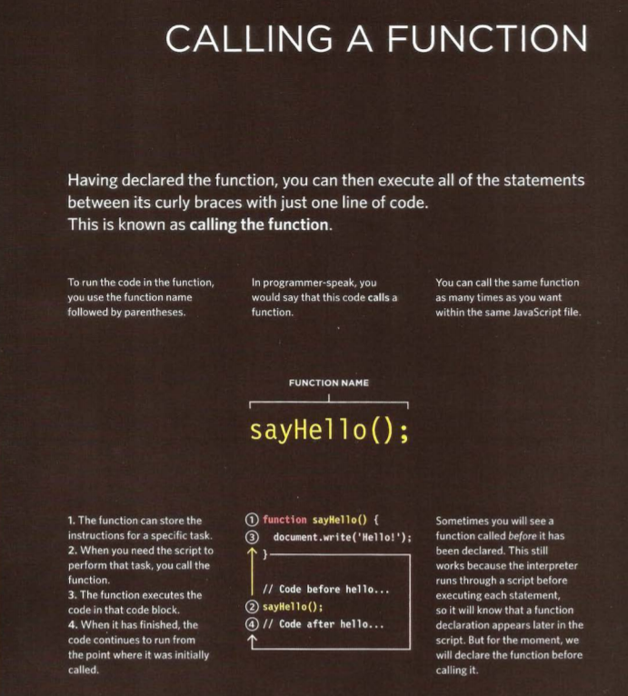
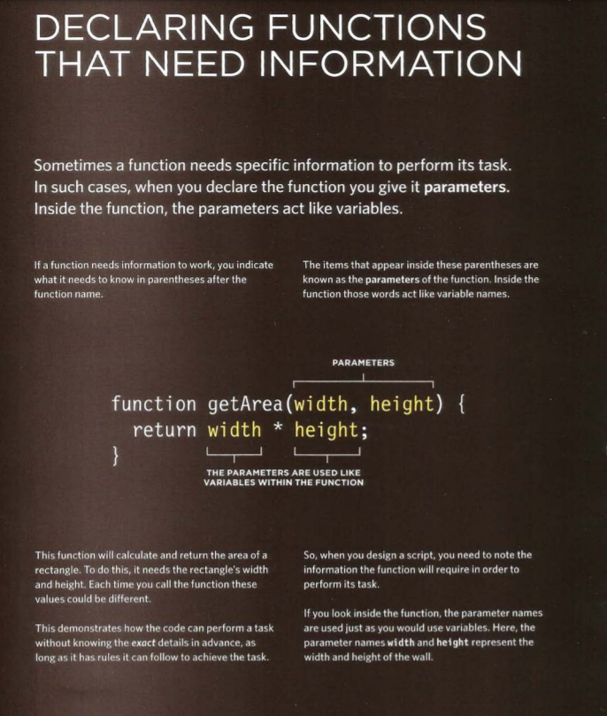
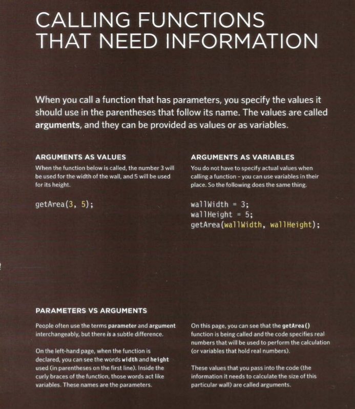

# Links

**Creating links between pages**

**Linking to other sites**

**Email links**

##Summary LINKS
- Links are created using the <'a'> element.
- The <'a'> element uses the href attribute to indicate the page you are linking to.
- If you are linking to a page within your own site, it is best to use relative links rather than qualified URLs.
- You can create links to open email programs with an email address in the "to" field.
- You can use the id attribute to target elements within a page that can be linked to.

-------------------------------------------------------------

# Layout

**Key Concepts in Positioning Elements**

**Containing Elements**
_If one block-level element sits inside another block-level element then the outer box is known as the containing or parent element._

**Controlling the Position of Elements**

--------------------------------------------------------------

# Functions, Methods, and Objects

- **How declear a Function**

- **How Call the Function**

- **How declear a Function that need Parameters**

- **How Call a Function that need Parameters**

### VARIABLE SCOPE 

_The location where you declare a variable will affect where it can be used within your code. If you declare it within a function, it can only be used within that function. This is known as the variable's scope._

- ##### LOCAL VARIABLES

When a variable is created inside a function using the
var keyword, it can only be used in that function.
It is called a local variable or function-level variable.
It is said to have local scope or function-level scope.
It cannot be accessed outside of the function in
which it was declared. Below, area is a local variable. 

- ##### GLOBAL VARIABLES

If you create a variable outside of a function, then it
can be used anywhere within the script. It is called a
global variable and has global scope. In the example
shown, wa 11 Size is a global variable. 

##### HOW MEMORY & VARIABLES WORK

Global variables use more memory. The browser has to remember them
for as long as the web page using them is loaded. Local variables are only
remembered during the period of time that a function is being executed. 

# Pair Programming

pair programming is the practice of two developers sharing a single workstation to interactively tackle a coding task together.

- **How does pair programming work?**

While there are many different styles, pair programming commonly involves two roles: the Driver and the Navigator. The Driver is the programmer who is typing and the only one whose hands are on the keyboard. Handling the “mechanics” of coding, the Driver manages the text editor, switching files, version control, and—of course writing—code. The Navigator uses their words to guide the Driver but does not provide any direct input to the computer. The Navigator thinks about the big picture, what comes next, how an algorithm might be converted in to code, while scanning for typos or bugs. The Navigator might also utilize their computer as a second screen to look up solutions and documentation, but should not be writing any code.